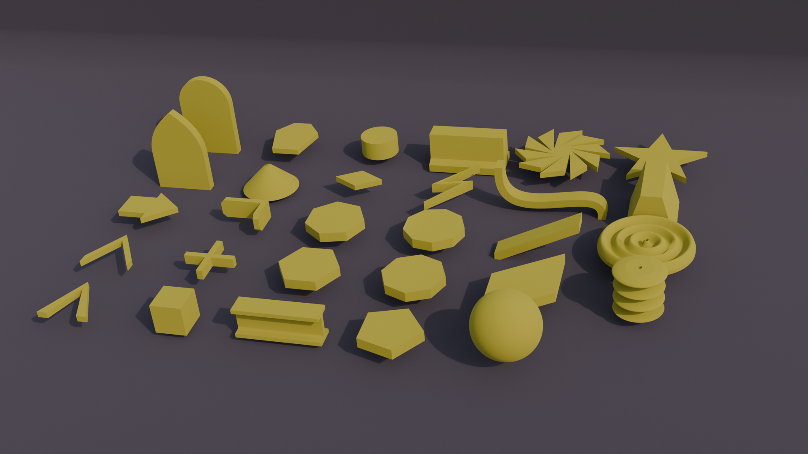

# cadqueryhelper
CadQuery Helper library.<br />
Code for shape primitives, looping groups of shapes, hinges, and various wave operations.



## Documentation
* [Shapes](./documentation/shapes.md)
* [Series](./documentation/series.md)
* [Grid](./documentation/grid.md)
* [Irregular Grid](./documentation/irregularGrid.md)
* [Wave](./documentation/wave.md)
* [Hinge](./documentation/hinge.md)

## Changes
* [Changelog](./changes.md)

## Dependencies
* [CadQuery 2.3>](https://github.com/CadQuery/cadquery)
* [cqMore](https://github.com/JustinSDK/cqMore)
  
---

### Installation
To install CadQuery Helper directly from GitHub, run the following `pip` command:

	pip install git+https://github.com/medicationforall/cadqueryhelper

**OR**

### Local Installation
From the cloned cadqueryhelper directory run.

	pip install ./

---

## Running Example Scripts
* From the root of the project run of example_runner.py:

``` bash
C:\Users\<user>\cadqueryhelper>python example_runner.py
```

**OR**

* From the root of the project run of the example scripts:


``` bash
C:\Users\<user>\cadqueryhelper>python ./example/shape/arrow.py
```
