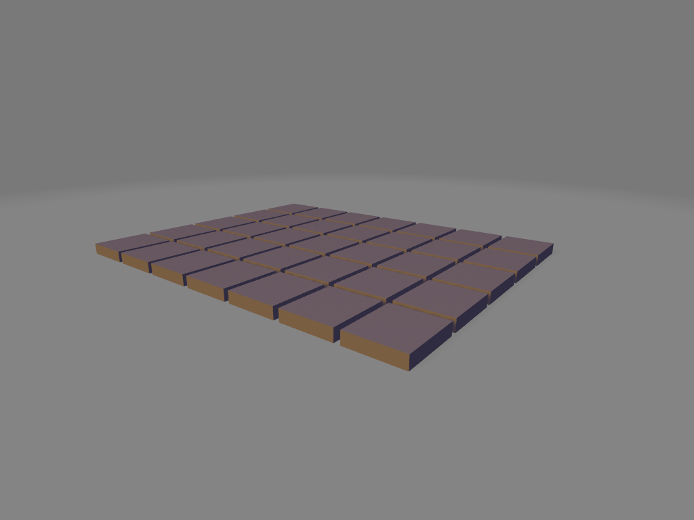
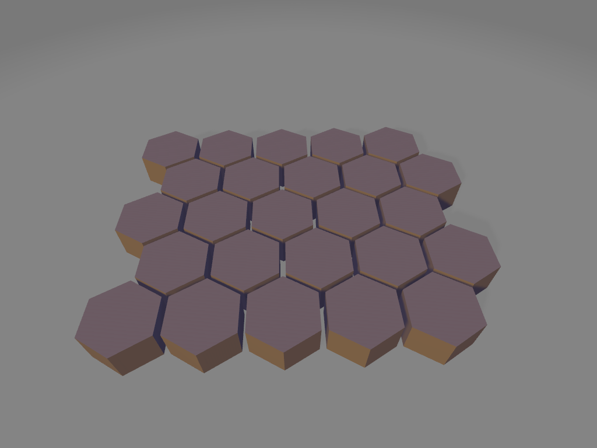

# Grid Documentation

## make_grid
simple loop that repeats the given shape n-number of times for the rows and columns parameters.

### Parameters
* part
* dim
* odd_col_push
* columns
* rows

``` python
cube = shape.cube(9,10,2)
ex_grid = grid.make_grid(part=cube, dim = [10,11], rows=7)
```

<br />

* [source](../src/cadqueryhelper/grid.py)
* [example](../example/exampleGrid.py)
* [stl](../stl/grid.stl)

### Examples

#### Hex Grid with offset
``` python
hexagon = shape.regular_polygon(sides=6).rotate((0,0,1),(0,0,0), 30)
ex_grid = grid.make_grid(part = hexagon, dim = [9.5,8], odd_col_push = [4.7,0])
```

<br />

* [example](../example/hexagonGrid.py)
* [stl](../stl/hexgrid.stl)
