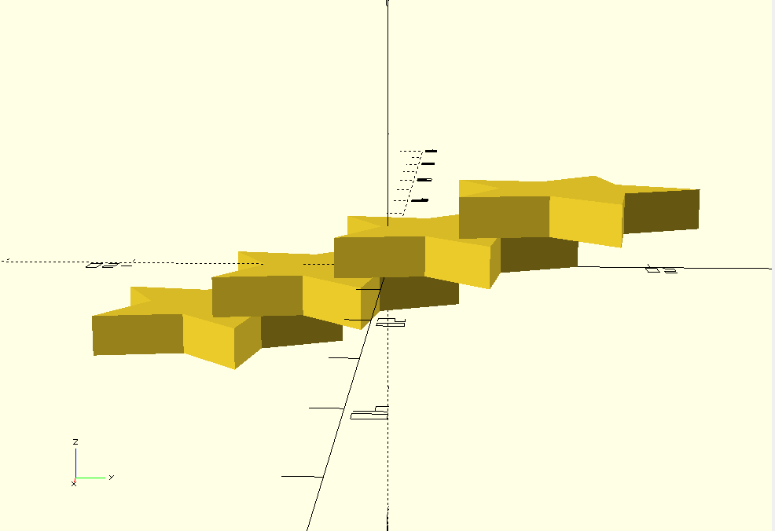

# Grid Documentation
---
- [Grid Documentation](#grid-documentation)
  - [Irregular Grid](#irregular-grid)
    - [parameters](#parameters)
    - [An Uninteresting Grid](#an-uninteresting-grid)
    - [Example](#example)
  - [make\_grid](#make_grid)
    - [Parameters](#parameters-1)
    - [Examples](#examples)
      - [Hex Grid with offset](#hex-grid-with-offset)
  - [Randomized Rotation Grid](#randomized-rotation-grid)
    - [paramaters](#paramaters)
  - [Rotate Grid](#rotate-grid)
    - [parameters](#parameters-2)
  - [Scheme Grid](#scheme-grid)
    - [parameters](#parameters-3)
  - [Series](#series)
    - [parameters](#parameters-4)
    - [returns](#returns)
    - [Examples](#examples-1)
      - [Star series repeated over the y-axis](#star-series-repeated-over-the-y-axis)
      - [Star series repeated over the y and z-axis](#star-series-repeated-over-the-y-and-z-axis)
      - [Star series repeated over the x, y and z-axis](#star-series-repeated-over-the-x-y-and-z-axis)
    - [Series with operation applied](#series-with-operation-applied)

---

## Irregular Grid

### parameters
* **length** = 75 - Length of the grid.
* **width** = 50 - Width of the Grid.
* **height** = 2 - Initial height of the Grid items.
* **col_size** = 5 - Length of the column divisions.
* **row_size** = 5 - Width of the row divisions.
* **max_columns** = None - Each item can span a max of N columns.
* **max_rows** = None - Each item can span a max of N rows.
* **max_height** = 2 - Randomly rolled max height of items.
* **align_z** = False - When True centers each item on the z axis.
* **include_outline** = False - Render baseplate solid, helpful for debugging.
* **union_grid** = True - Add items to the grid using union command, otherwise uses add command.
* **passes_count** = None - Max number of render passes, None means run until the grid is full.
* **seed** = "test" - Pseudo random item placement is effected by this string, change this to get different output results.
* **make_item** = None - Callback method for making items. Whatever method you feed this has to accept three parameters length, width, and height. The passed in method should return a workplane with a solid.
* **fill_cells** = None - Allows you to hardcode items to specific start points and dimensions. 

### An Uninteresting Grid
<br />

``` python
import cadquery as cq
from cadqueryhelper import irregular_grid

grid = irregular_grid(
    length = 75,
    width = 50,
    height = 2,
    max_height = 2,
    max_columns = 1,
    max_rows = 1,
    col_size = 5,
    row_size = 5,
    align_z = False,
    include_outline = False,
    passes_count = None,
    seed = "test",
    make_item = None,
    union_grid = False,
)
```

### Example
``` python
def custom_item(length, width, height):
    return (
        cq.Workplane("XY")
        .box(length-1, width-1, height)
        .chamfer(0.5)
    )

i_grid_4_sky_scapers = irregular_grid(
    length = 100,
    width = 100,
    height = 2,
    col_size = 10,
    row_size = 5,
    max_columns = 4,
    max_rows = 4,
    max_height=50,
    align_z = True,
    include_outline = True,
    union_grid = True,
    passes_count = 160,
    seed = "purple",
    make_item = custom_item
)
```

<br />

* [code](../src/cadqueryhelper/grid/irregularGrid.py)
* [example](../example/grid/irregularGrid.py)
* [hard coded example](../example/grid/irregularGrid_hardCoded.py)
* [stl](../stl/grid_irregular.stl)
* [stl skyscrapers](../stl/grid_irregular_4_sky_scrapers.stl)

---

## make_grid
simple loop that repeats the given shape n-number of times for the rows and columns parameters.

### Parameters
* part
* dim
* odd_col_push
* columns
* rows

``` python
cube = shape.cube(9,10,2)
ex_grid = grid.make_grid(part=cube, dim = [10,11], rows=7)
```

<br />

* [source](../src/cadqueryhelper/grid/grid.py)
* [example](../example/grid/exampleGrid.py)
* [stl](../stl/grid.stl)

### Examples

#### Hex Grid with offset
``` python
hexagon = shape.regular_polygon(sides=6).rotate((0,0,1),(0,0,0), 30)
ex_grid = grid.make_grid(part = hexagon, dim = [9.5,8], odd_col_push = [4.7,0])
```

<br />

* [example](../example/grid/hexagonGrid.py)
* [stl](../stl/grid_hexgrid.stl)

---

## Randomized Rotation Grid

### paramaters
* shape: cq.Workplane|None 
* seed: str|None
* rotate_increment: int
* rotate_min: int
* rotate_max: int
* x_count: int
* y_count: int
* x_spacing: float 
* y_spacing: float

``` python
import cadquery as cq
from cadqueryhelper.grid import randomized_rotation_grid
from cadqueryhelper.shape import arrow

ex_arrow = arrow(
  length=10,
  inner_length=5,
  width=5,
  width_outset=2,
  height=3
)

ex_grid = randomized_rotation_grid(
        shape = ex_arrow, 
        seed = "test",
        rotate_increment = 90, 
        rotate_min = 0, 
        rotate_max = 360,
        x_count = 5,
        y_count = 5,
        x_spacing = 10,
        y_spacing = 10
)

show_object(ex_grid)
```


* [source](../src/cadqueryhelper/grid/randomizedRotationGrid.py)
* [example](../example/grid/randomized_rotation_grid.py)
* [stl](../stl/grid_randomized_rotation.stl)

---

## Rotate Grid

### parameters
* shape: cq.Workplane|None
* rotate_increment: float
* x_spacing: float 
* y_spacing: float
* x_count: int 
* y_count: int
* mod_reset: int

``` python
import cadquery as cq
from cadqueryhelper.grid import rotate_grid
from cadqueryhelper.shape import arrow

ex_arrow = arrow(
  length=10,
  inner_length=5,
  width=5,
  width_outset=2,
  height=3
)

ex_grid = rotate_grid(
    shape = ex_arrow,
    rotate_increment=-90,
    x_spacing = 10, 
    y_spacing = 10,
    x_count = 4, 
    y_count = 4,
    mod_reset = 4
)

show_object(ex_grid)
```

* [source](../src/cadqueryhelper/grid/rotateGrid.py)
* [example](../example/grid/rotate_grid.py)
* [stl](../stl/grid_rotate.stl)

---
## Scheme Grid

### parameters

``` python
```

* [source](../src/cadqueryhelper/grid/grid.py)
* [example](../example/grid/exampleGrid.py)
* [stl](../stl/grid.stl)

---

## Series
### parameters
* shape:cq.Workplane, 
* size:int = 5, 
* length_offset:float|None = None, 
* width_offset:float|None = None, 
* height_offset:float|None = None, 
* skip_last:int = 0, 
* skip_first:int = 0, 
* operation: Callable[[cq.Workplane, int, int, dict], cq.Workplane]|None=None,
* union:bool=False

### returns
* cq.Workplane

simple loop that repeats the given shape n-number of times based on the *size* parameter.

* [source](../src/cadqueryhelper/grid/series.py)
* [example](../example/grid/series.py)
* [stl](../stl/grid_series.stl)

### Examples

#### Star series repeated over the y-axis
``` python
import cadquery as cq
from cadqueryhelper import shape
from cadqueryhelper import series

if __name__ == "__main__":
    star = shape.star()

    st_series = series(shape = star, length_offset=None, width_offset=-11, height_offset=None, size=4)
    cq.exporters.export(st_series,'stl/series.stl')

    if st_series.metadata:
        print(st_series.metadata)
```


<br />

#### Star series repeated over the y and z-axis
``` python
  series(shape = star, length_offset=None, width_offset=-11, height_offset=0, size=4)
```
<br />

#### Star series repeated over the x, y and z-axis
``` python
  series(shape = star, length_offset=1, width_offset=-11, height_offset=0, size=3)
```
<br />


### Series with operation applied
``` python
import cadquery as cq
from cadqueryhelper import shape
from cadqueryhelper import series

# yoinked from cqterrain
def frame_shape(length=20, width = 4, height = 40, frame_width=3):
    outline = cq.Workplane("XY").box(length, width, height)
    inline =  cq.Workplane("XY").box(length-(frame_width*2), width, height-(frame_width*2))
    return outline.cut(inline)

# yoinked from cqterrain
def rail_operation(tile, size, index, bounding_box):
    rail_rotation = 0
    if index % 2 == 1:
        rail_rotation = 180
    win_rail = (
        shape.rail(length=12-3, width=5-2, height=16-3)
        .rotate((0,0,1),(0,0,0),rail_rotation)
    )

    # copy the tile instance to a new workplane
    new_tile = cq.Workplane("XY").add(tile).add(win_rail)
    return new_tile

# make the frame instance
frame = frame_shape(length=12, width = 5, height = 16)

# make the series of frames
# appliy the operation in order to make alternating internal rail patern
frame_series = series(shape=frame, size=5, length_offset=3, operation=rail_operation)

show_object(frame_series)
```

* [example](../example/grid/seriesOperation.py)
* [stl](../stl/grid_seriesOperation.stl)

<br />
