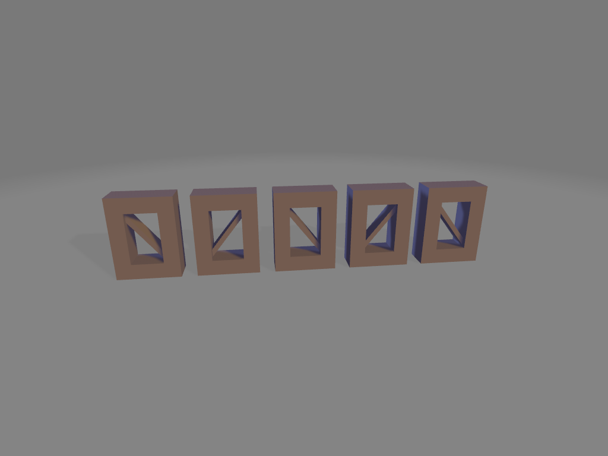

# Grid Documentation
---
- [Grid Documentation](#grid-documentation)
  - [Cell Single](#cell-single)
    - [parameters](#parameters)
  - [Cell Stretch Points](#cell-stretch-points)
    - [parameters](#parameters-1)
    - [returns](#returns)
  - [Grid Arc Points](#grid-arc-points)
  - [parameters](#parameters-2)
    - [returns](#returns-1)
    - [coord example](#coord-example)
  - [Grid Arc Points Random](#grid-arc-points-random)
    - [parameters](#parameters-3)
  - [Grid Cell Basic](#grid-cell-basic)
    - [parameters](#parameters-4)
    - [Arc Example](#arc-example)
  - [Grid Random Example](#grid-random-example)
  - [Grid Arc Random Example](#grid-arc-random-example)
  - [Grid Mod Example](#grid-mod-example)
  - [Grid Cell Random](#grid-cell-random)
    - [parameters](#parameters-5)
  - [Grid Points](#grid-points)
    - [parameters](#parameters-6)
    - [returns](#returns-2)
    - [points data](#points-data)
    - [coord example](#coord-example-1)
    - [points data](#points-data-1)
  - [Grid Points Mod](#grid-points-mod)
    - [parameters](#parameters-7)
    - [returns](#returns-3)
  - [Grid Points Random](#grid-points-random)
    - [parameters](#parameters-8)
    - [returns](#returns-4)
    - [Points Data](#points-data-2)
    - [Coord Example](#coord-example-2)
    - [points data](#points-data-3)
  - [Join Points Interlock](#join-points-interlock)
    - [parameters](#parameters-9)
  - [Points Randomize](#points-randomize)
    - [parameters](#parameters-10)
    - [returns](#returns-5)
  - [Irregular Grid](#irregular-grid)
    - [parameters](#parameters-11)
    - [An Uninteresting Grid](#an-uninteresting-grid)
    - [Example](#example)
  - [make\_grid](#make_grid)
    - [Parameters](#parameters-12)
    - [Examples](#examples)
      - [Hex Grid with offset](#hex-grid-with-offset)
  - [Randomized Rotation Grid](#randomized-rotation-grid)
    - [paramaters](#paramaters)
  - [Rotate Grid](#rotate-grid)
    - [parameters](#parameters-13)
  - [Scheme Grid](#scheme-grid)
    - [parameters](#parameters-14)
  - [Series](#series)
    - [parameters](#parameters-15)
    - [returns](#returns-6)
    - [Examples](#examples-1)
      - [Star series repeated over the y-axis](#star-series-repeated-over-the-y-axis)
      - [Star series repeated over the y and z-axis](#star-series-repeated-over-the-y-and-z-axis)
      - [Star series repeated over the x, y and z-axis](#star-series-repeated-over-the-x-y-and-z-axis)
    - [Series with operation applied](#series-with-operation-applied)

---

## Cell Single
Represents a single cell in a grid

### parameters
* points: list[tuple[float,float]]
* height: float|None
* taper: float|None
* offset: float|None

``` python
import cadquery as cq
from cadqueryhelper.grid import cell_single

points:list[tuple[float,float]] = [
    (0,0),
    (0,4),
    (4,4),
    (4,0)
]

ex_cell = cell_single(
    points=points,
    height=1,
    taper=25,
    offset=-.25
)

show_object(ex_cell)
```


* [source](../src/cadqueryhelper/grid/cell_single.py)
* [example](../example/grid/cell_single.py)
* [stl](../stl/grid_cell_single.stl)
---

## Cell Stretch Points
Transforms a list grid of rows and column coordinates into a list list of cells coordinates.

### parameters
* points: list[list[tuple[float,float]]]
* x_stretch: int
* y_stretch: int

### returns
* list[list[tuple[float,float]]]

``` python
import cadquery as cq
from cadqueryhelper.grid import grid_points, cell_stretch_points

points, stream = grid_points(
    columns = 10,
    rows = 10,
    x_spacing = 5,
    y_spacing = 5
)

cell_points = cell_stretch_points(
    points,
    x_stretch = 2,
    y_stretch = 2
)

pattern = cq.Workplane("XY")

for points in cell_points:
    face = cq.Workplane("XY").polyline(points).close()
    pattern = pattern.add(face)

show_object(pattern)
```

input columns = 10, rows = 10, x_spacing = 5, y_spacing = 5:
```
[
    [(0, 0), (5, 0), (10, 0), (15, 0), (20, 0), (25, 0), (30, 0), (35, 0), (40, 0), (45, 0)], 
    [(0, -5), (5, -5), (10, -5), (15, -5), (20, -5), (25, -5), (30, -5), (35, -5), (40, -5), (45, -5)], 
    [(0, -10), (5, -10), (10, -10), (15, -10), (20, -10), (25, -10), (30, -10), (35, -10), (40, -10), (45, -10)], 
    [(0, -15), (5, -15), (10, -15), (15, -15), (20, -15), (25, -15), (30, -15), (35, -15), (40, -15), (45, -15)], 
    [(0, -20), (5, -20), (10, -20), (15, -20), (20, -20), (25, -20), (30, -20), (35, -20), (40, -20), (45, -20)], 
    [(0, -25), (5, -25), (10, -25), (15, -25), (20, -25), (25, -25), (30, -25), (35, -25), (40, -25), (45, -25)], 
    [(0, -30), (5, -30), (10, -30), (15, -30), (20, -30), (25, -30), (30, -30), (35, -30), (40, -30), (45, -30)], 
    [(0, -35), (5, -35), (10, -35), (15, -35), (20, -35), (25, -35), (30, -35), (35, -35), (40, -35), (45, -35)], 
    [(0, -40), (5, -40), (10, -40), (15, -40), (20, -40), (25, -40), (30, -40), (35, -40), (40, -40), (45, -40)], 
    [(0, -45), (5, -45), (10, -45), (15, -45), (20, -45), (25, -45), (30, -45), (35, -45), (40, -45), (45, -45)]
]
```
<br />

output x_stretch = 2, y_stretch = 2:
```
[
    [(0, 0), (5, 0), (10, 0), (10, -5), (10, -10), (5, -10), (0, -10), (0, -5)], 
    [(10, 0), (15, 0), (20, 0), (20, -5), (20, -10), (15, -10), (10, -10), (10, -5)], 
    [(20, 0), (25, 0), (30, 0), (30, -5), (30, -10), (25, -10), (20, -10), (20, -5)], 
    [(30, 0), (35, 0), (40, 0), (40, -5), (40, -10), (35, -10), (30, -10), (30, -5)], 
    [(0, -10), (5, -10), (10, -10), (10, -15), (10, -20), (5, -20), (0, -20), (0, -15)], 
    [(10, -10), (15, -10), (20, -10), (20, -15), (20, -20), (15, -20), (10, -20), (10, -15)], 
    [(20, -10), (25, -10), (30, -10), (30, -15), (30, -20), (25, -20), (20, -20), (20, -15)], 
    [(30, -10), (35, -10), (40, -10), (40, -15), (40, -20), (35, -20), (30, -20), (30, -15)], 
    [(0, -20), (5, -20), (10, -20), (10, -25), (10, -30), (5, -30), (0, -30), (0, -25)], 
    [(10, -20), (15, -20), (20, -20), (20, -25), (20, -30), (15, -30), (10, -30), (10, -25)], 
    [(20, -20), (25, -20), (30, -20), (30, -25), (30, -30), (25, -30), (20, -30), (20, -25)], 
    [(30, -20), (35, -20), (40, -20), (40, -25), (40, -30), (35, -30), (30, -30), (30, -25)], 
    [(0, -30), (5, -30), (10, -30), (10, -35), (10, -40), (5, -40), (0, -40), (0, -35)], 
    [(10, -30), (15, -30), (20, -30), (20, -35), (20, -40), (15, -40), (10, -40), (10, -35)], 
    [(20, -30), (25, -30), (30, -30), (30, -35), (30, -40), (25, -40), (20, -40), (20, -35)], 
    [(30, -30), (35, -30), (40, -30), (40, -35), (40, -40), (35, -40), (30, -40), (30, -35)]
]
```

<br />
*Note* -  the last row and column are cut off because they are not eveningly divisible by two.

output x_stretch = 1, y_stretch = 1:
```
[
    [(0, 0), (5, 0), (5, -5), (0, -5)], 
    [(5, 0), (10, 0), (10, -5), (5, -5)], 
    [(10, 0), (15, 0), (15, -5), (10, -5)], 
    [(15, 0), (20, 0), (20, -5), (15, -5)], 
    [(20, 0), (25, 0), (25, -5), (20, -5)], 
    [(25, 0), (30, 0), (30, -5), (25, -5)], 
    [(30, 0), (35, 0), (35, -5), (30, -5)], 
    [(35, 0), (40, 0), (40, -5), (35, -5)], 
    [(40, 0), (45, 0), (45, -5), (40, -5)], 
    [(0, -5), (5, -5), (5, -10), (0, -10)], 
    [(5, -5), (10, -5), (10, -10), (5, -10)], 
    [(10, -5), (15, -5), (15, -10), (10, -10)], 
    [(15, -5), (20, -5), (20, -10), (15, -10)], 
    [(20, -5), (25, -5), (25, -10), (20, -10)], 
    [(25, -5), (30, -5), (30, -10), (25, -10)], 
    [(30, -5), (35, -5), (35, -10), (30, -10)], 
    [(35, -5), (40, -5), (40, -10), (35, -10)], 
    [(40, -5), (45, -5), (45, -10), (40, -10)], 
    [(0, -10), (5, -10), (5, -15), (0, -15)], 
    [(5, -10), (10, -10), (10, -15), (5, -15)], 
    [(10, -10), (15, -10), (15, -15), (10, -15)], 
    [(15, -10), (20, -10), (20, -15), (15, -15)], 
    [(20, -10), (25, -10), (25, -15), (20, -15)], 
    [(25, -10), (30, -10), (30, -15), (25, -15)], 
    [(30, -10), (35, -10), (35, -15), (30, -15)], 
    [(35, -10), (40, -10), (40, -15), (35, -15)], 
    [(40, -10), (45, -10), (45, -15), (40, -15)], 
    [(0, -15), (5, -15), (5, -20), (0, -20)], 
    [(5, -15), (10, -15), (10, -20), (5, -20)], 
    [(10, -15), (15, -15), (15, -20), (10, -20)], 
    [(15, -15), (20, -15), (20, -20), (15, -20)], 
    [(20, -15), (25, -15), (25, -20), (20, -20)], 
    [(25, -15), (30, -15), (30, -20), (25, -20)], 
    [(30, -15), (35, -15), (35, -20), (30, -20)], 
    [(35, -15), (40, -15), (40, -20), (35, -20)], 
    [(40, -15), (45, -15), (45, -20), (40, -20)], 
    [(0, -20), (5, -20), (5, -25), (0, -25)], 
    [(5, -20), (10, -20), (10, -25), (5, -25)], 
    [(10, -20), (15, -20), (15, -25), (10, -25)], 
    [(15, -20), (20, -20), (20, -25), (15, -25)], 
    [(20, -20), (25, -20), (25, -25), (20, -25)], 
    [(25, -20), (30, -20), (30, -25), (25, -25)], 
    [(30, -20), (35, -20), (35, -25), (30, -25)], 
    [(35, -20), (40, -20), (40, -25), (35, -25)], 
    [(40, -20), (45, -20), (45, -25), (40, -25)], 
    [(0, -25), (5, -25), (5, -30), (0, -30)], 
    [(5, -25), (10, -25), (10, -30), (5, -30)], 
    [(10, -25), (15, -25), (15, -30), (10, -30)], 
    [(15, -25), (20, -25), (20, -30), (15, -30)], 
    [(20, -25), (25, -25), (25, -30), (20, -30)], 
    [(25, -25), (30, -25), (30, -30), (25, -30)], 
    [(30, -25), (35, -25), (35, -30), (30, -30)], 
    [(35, -25), (40, -25), (40, -30), (35, -30)], 
    [(40, -25), (45, -25), (45, -30), (40, -30)], 
    [(0, -30), (5, -30), (5, -35), (0, -35)], 
    [(5, -30), (10, -30), (10, -35), (5, -35)], 
    [(10, -30), (15, -30), (15, -35), (10, -35)], 
    [(15, -30), (20, -30), (20, -35), (15, -35)], 
    [(20, -30), (25, -30), (25, -35), (20, -35)], 
    [(25, -30), (30, -30), (30, -35), (25, -35)], 
    [(30, -30), (35, -30), (35, -35), (30, -35)], 
    [(35, -30), (40, -30), (40, -35), (35, -35)], 
    [(40, -30), (45, -30), (45, -35), (40, -35)], 
    [(0, -35), (5, -35), (5, -40), (0, -40)], 
    [(5, -35), (10, -35), (10, -40), (5, -40)], 
    [(10, -35), (15, -35), (15, -40), (10, -40)], 
    [(15, -35), (20, -35), (20, -40), (15, -40)], 
    [(20, -35), (25, -35), (25, -40), (20, -40)], 
    [(25, -35), (30, -35), (30, -40), (25, -40)], 
    [(30, -35), (35, -35), (35, -40), (30, -40)], 
    [(35, -35), (40, -35), (40, -40), (35, -40)], 
    [(40, -35), (45, -35), (45, -40), (40, -40)], 
    [(0, -40), (5, -40), (5, -45), (0, -45)], 
    [(5, -40), (10, -40), (10, -45), (5, -45)], 
    [(10, -40), (15, -40), (15, -45), (10, -45)], 
    [(15, -40), (20, -40), (20, -45), (15, -45)], 
    [(20, -40), (25, -40), (25, -45), (20, -45)], 
    [(25, -40), (30, -40), (30, -45), (25, -45)], 
    [(30, -40), (35, -40), (35, -45), (30, -45)], 
    [(35, -40), (40, -40), (40, -45), (35, -45)], 
    [(40, -40), (45, -40), (45, -45), (40, -45)]
]
```


* [source](../src/cadqueryhelper/grid/cell_stretch_points.py)
* [example](../example/grid/cell_stretch_points.py)
  
---

## Grid Arc Points
Generate gird points along an arc

## parameters
* columns: int
* rows: int
* x_spacing: float
* angle: float
* row_increment: int - increases the number of points per row

### returns 
* tuple[list[list[tuple[float,float]]], list[tuple[float,float]]]

``` python
import cadquery as cq
from cadqueryhelper.grid import grid_arc_points

points, stream = grid_arc_points(
    columns = 10,
    rows = 8,
    x_spacing = 10,
    angle = 90,
    row_increment = 0
)

example = cq.Workplane("XY").pushPoints(stream).box(1,1,1)

show_object(example)
```


* [source](../src/cadqueryhelper/grid/grid_arc_points.py)
* [example](../example/grid/grid_arc_points.py)
* [stl](../stl/grid_arc_points.stl)

### coord example
``` python
import cadquery as cq
from cadqueryhelper.grid import grid_arc_points

points, stream = grid_arc_points(
    columns = 5,
    rows = 6,
    x_spacing = 10,
    angle = 90,
    row_increment = 0
)

counter = 0
def add_coord_text(loc:cq.Location)->cq.Shape:
    global counter
    coord = loc.toTuple()[0]
    x = coord[0]
    y = coord[1]
    t = cq.Workplane("XY").text(f"{counter}({int(x)},{int(y)})",2.5,1)
    counter += 1
    return t.val().located(loc) #type:ignore

example = (
    cq.Workplane("XY")
    .pushPoints(stream)
    .eachpoint(add_coord_text)
)

show_object(example)
```


* [example](../example/grid/grid_arc_points_coords.py)
* [stl](../stl/grid_arc_points_coords.stl)

---

## Grid Arc Points Random

### parameters
* columns: int
* rows: int
* x_spacing: float
* angle: float
* row_increment: int
* shift_x: tuple[float, float, float] - min max step
* shift_y: tuple[float, float, float] - min max step
* seed: str|None

``` python
import cadquery as cq
from cadqueryhelper.grid import grid_arc_points_random

points, stream = grid_arc_points_random(
    columns = 10,
    rows = 4,
    x_spacing = 10,
    angle = 90,
    row_increment = 1,
    shift_x = (-10, 10, 1), #min max step
    shift_y = (-10, 10, 1.5), #min max step
    seed= 'tes1'
)

example = cq.Workplane("XY").pushPoints(stream).box(1,1,1)

show_object(example)
```


* [source](../src/cadqueryhelper/grid/grid_arc_points_random.py)
* [example](../example/grid/grid_arc_points_random.py)
* [stl](../stl/grid_arc_points_random.stl)

---

## Grid Cell Basic
Basic proof of concept grid built from cell stretch transformation

### parameters
* cells_collection: list[list[tuple[float,float]]]
* height: float|None
* taper: float|None - angle
* offset: float|None - offset2D

```
import cadquery as cq
from cadqueryhelper.grid import grid_points, cell_stretch_points, grid_cell_basic

points, stream = grid_points(
    columns = 10,
    rows = 10,
    x_spacing = 5,
    y_spacing = 5
)

cell_points = cell_stretch_points(
    points,
    x_stretch = 3,
    y_stretch = 3
)

grid = grid_cell_basic(
    cell_points,
    height=1,
    taper= 25,
    offset=None
)

#show_object(grid)
```


* [source](../src/cadqueryhelper/grid/grid_cell_basic.py)
* [example](../example/grid/grid_cell_basic.py)
* [stl](../stl/grid_cell_basic.stl)


### Arc Example
``` python
import cadquery as cq
from cadqueryhelper.grid import grid_arc_points, cell_stretch_points, grid_cell_basic

points, stream = grid_arc_points(
    columns = 13,
    rows = 13,
    x_spacing = 5,
    angle = 180
)

cell_points = cell_stretch_points(
    points,
    x_stretch = 1,
    y_stretch = 1
)

grid = grid_cell_basic(
    cell_points,
    height=1,
    taper= 25
)

show_object(grid)
```


* [example](../example/grid/grid_cell_basic_arc.py)
* [stl](../stl/grid_cell_basic_arc.stl)

## Grid Random Example
``` python
import cadquery as cq
from cadqueryhelper.grid import grid_points_random, cell_stretch_points, grid_cell_basic

points, stream = grid_points_random(
    columns = 10,
    rows = 10,
    x_spacing = 5,
    y_spacing = 5,
    shift_x = (-2, 2, 1),#min max step
    shift_y = (-2, 2, .5),#min max step
    seed = 'test9'
)

cell_points = cell_stretch_points(
    points,
    x_stretch = 3,
    y_stretch = 2
)

grid = grid_cell_basic(
    cell_points,
    height=1,
    taper= 15
)

show_object(grid)
```


* [example](../example/grid/grid_cell_basic_random.py)
* [stl](../stl/grid_cell_basic_random.stl)

## Grid Arc Random Example

``` python
import cadquery as cq
from cadqueryhelper.grid import grid_arc_points_random, cell_stretch_points, grid_cell_basic

points, stream = grid_arc_points_random(
    columns = 17,
    rows = 6,
    x_spacing = 5,
    angle = 90,
    shift_x = (-2, 2, 1),#min max step
    shift_y = (-3, 2, .5),#min max step
    seed = 'test'
)

cell_points = cell_stretch_points(
    points,
    x_stretch = 2,
    y_stretch = 4
)

grid = grid_cell_basic(
    cell_points,
    height=1,
    taper= 30
)

show_object(grid)
```


* [example](../example/grid/grid_cell_basic_arc_random.py)
* [stl](../stl/grid_cell_basic_arc_random.stl)

## Grid Mod Example

``` python
import cadquery as cq
from cadqueryhelper.grid import grid_points_mod ,cell_stretch_points, grid_cell_basic

points, stream = grid_points_mod(
    columns = 10,
    rows = 10,
    x_spacing = [5,10],
    y_spacing = [5],
    row_x_mod = [0,1],
    row_x_offset = [0,-2.5]
)

cell_points = cell_stretch_points(
    points,
    x_stretch = 1,
    y_stretch = 1
)

grid = grid_cell_basic(
    cell_points,
    height=1,
    taper= 25
)

show_object(grid)
```


* [example](../example/grid/grid_cell_basic_mod.py)
* [stl](../stl/grid_cell_basic_mod.stl)

---

## Grid Cell Random
Generates psuedo randomized cells based on a given seed string. Uses min,max,step for each attribute that can be radomly selected.

### parameters
* cells_collection: list[list[tuple[float,float]]] - list of cells
* height: tuple[float,float,float]|float|None - (min,max,step) or float or none
* taper: tuple[float,float,float]|float|None - (min,max,step) or float or none
* offset: tuple[float,float,float]|float|None= (min,max,step) or float or none
* seed: str

``` python
import cadquery as cq
from cadqueryhelper.grid import grid_points, cell_stretch_points, grid_cell_random

points, stream = grid_points(
    columns = 10,
    rows = 10,
    x_spacing = 5,
    y_spacing = 5
)

cell_points = cell_stretch_points(
    points,
    x_stretch = 3,
    y_stretch = 3
)

grid = grid_cell_random(
    cell_points,
    height = (1,5,1),
    offset = (-1,0,.25),
    taper = (5,60,5),
    seed = 'abhi'
)

show_object(grid)
```


* [source](../src/cadqueryhelper/grid/grid_cell_random.py)
* [example](../example/grid/grid_cell_random.py)
* [stl](../stl/grid_cell_random.stl)

---

## Grid Points
Generates points data

### parameters
* columns: int
* rows: int
* x_spacing: float
* y_spacing: float

### returns
* tuple[list[list[tuple[float,float]]], list[tuple[float,float]]]


``` python
import cadquery as cq
from cadqueryhelper.grid import grid_points

points, stream = grid_points(
    columns = 5,
    rows = 6,
    x_spacing = 5,
    y_spacing = 5
)
example = cq.Workplane("XY").pushPoints(stream).box(1,1,1)

show_object(example)
```
### points data
```
[
    [(0, 0), (5, 0), (10, 0), (15, 0), (20, 0)], 
    [(0, -5), (5, -5), (10, -5), (15, -5), (20, -5)], 
    [(0, -10), (5, -10), (10, -10), (15, -10), (20, -10)], 
    [(0, -15), (5, -15), (10, -15), (15, -15), (20, -15)], 
    [(0, -20), (5, -20), (10, -20), (15, -20), (20, -20)], 
    [(0, -25), (5, -25), (10, -25), (15, -25), (20, -25)]
]
```


* [source](../src/cadqueryhelper/grid/grid_points.py)
* [example](../example/grid/grid_points.py)
* [stl](../stl/grid_points.stl)

### coord example
``` python
import cadquery as cq
from cadqueryhelper.grid import grid_points

points, stream = grid_points(
    columns = 5,
    rows = 6,
    x_spacing = 10,
    y_spacing = 5
)

def add_coord_text(loc:cq.Location)->cq.Shape:
    #log(loc.toTuple())
    coord = loc.toTuple()[0]
    x = coord[0]
    y = coord[1]
    t = cq.Workplane("XY").text(f"({int(x)},{int(y)})",2.5,1)
    return t.val().located(loc) #type:ignore

example = (
    cq.Workplane("XY")
    .pushPoints(stream)
    .eachpoint(add_coord_text)
)

show_object(example)
```

### points data
```
[
    [(0, 0), (10, 0), (20, 0), (30, 0), (40, 0)], 
    [(0, -5), (10, -5), (20, -5), (30, -5), (40, -5)], 
    [(0, -10), (10, -10), (20, -10), (30, -10), (40, -10)], 
    [(0, -15), (10, -15), (20, -15), (30, -15), (40, -15)], 
    [(0, -20), (10, -20), (20, -20), (30, -20), (40, -20)], 
    [(0, -25), (10, -25), (20, -25), (30, -25), (40, -25)]
]
```


* [example](../example/grid/grid_points_coords.py)
* [stl](../stl/grid_points_coords.stl)

---

## Grid Points Mod
Generated a grid of points using modulus modifiers

### parameters
* columns:int = 5,
* rows:int = 6,
* x_spacing:float|list[float] - list of lengths to go between
* y_spacing:float|list[float] - list of widths to go between
* row_x_mod:list[int] - row starting x_spacing index
* row_x_offset:list[float] - List of Starting row offsets to utilize 

### returns
* tuple[list[list[tuple[float,float]]], list[tuple[float,float]]]

``` python
import cadquery as cq
from cadqueryhelper.grid import grid_points_mod

points, stream = grid_points_mod(
    columns = 8,
    rows = 7,
    x_spacing = [5,10],
    y_spacing = 5,
    row_x_mod = [0,1],
    row_x_offset = [0,-2.5]
)
example = cq.Workplane("XY").pushPoints(stream).box(1,1,1)

show_object(example)
```

```
[
    [(0, 0), (10, 0), (15, 0), (25, 0), (30, 0), (40, 0), (45, 0), (55, 0)], 
    [(2.5, -5), (7.5, -5), (17.5, -5), (22.5, -5), (32.5, -5), (37.5, -5), (47.5, -5), (52.5, -5)], 
    [(0, -10), (10, -10), (15, -10), (25, -10), (30, -10), (40, -10), (45, -10), (55, -10)], 
    [(2.5, -15), (7.5, -15), (17.5, -15), (22.5, -15), (32.5, -15), (37.5, -15), (47.5, -15), (52.5, -15)], 
    [(0, -20), (10, -20), (15, -20), (25, -20), (30, -20), (40, -20), (45, -20), (55, -20)], 
    [(2.5, -25), (7.5, -25), (17.5, -25), (22.5, -25), (32.5, -25), (37.5, -25), (47.5, -25), (52.5, -25)], 
    [(0, -30), (10, -30), (15, -30), (25, -30), (30, -30), (40, -30), (45, -30), (55, -30)]
]
```


* [source](../src/cadqueryhelper/grid/grid_points_mod.py)
* [example](../example/grid/grid_points_mod.py)
* [stl](../stl/grid_points_mod.stl)


---

## Grid Points Random
Generates randomized point data in roughly a grid shape.

### parameters
* columns: int
* rows: int
* x_spacing: float
* y_spacing: float
* shift_x: tuple[float, float, float] - min max step
* shift_y: tuple[float, float, float] - min max step
* seed: str|None - Different strings will create different random results

### returns
* tuple[list[list[tuple[float,float]]], list[tuple[float,float]]]


``` python
import cadquery as cq
from cadqueryhelper.grid import grid_points_random

points, stream = grid_points_random(
    columns = 5,
    rows = 6,
    x_spacing = 10,
    y_spacing = 10,
    shift_x = (-2, 5, 1),#min max step
    shift_y = (-3, 5, .5),#min max step
    seed = 'test'
)

example = cq.Workplane("XY").pushPoints(stream).box(1,1,1)

show_object(example)
```
### Points Data
```
 [
    [(2.0, 0.5), (11.0, -2.5), (24.0, -1.0), (31.0, 5.0), (43.0, 1.0)], 
    [(3.0, -5.5), (13.0, -7.5), (24.0, -8.5), (31.0, -8.0), (41.0, -13.0)], 
    [(1.0, -22.0), (12.0, -15.5), (23.0, -16.0), (29.0, -17.0), (41.0, -21.5)], 
    [(-1.0, -27.5), (11.0, -32.5), (24.0, -27.5), (33.0, -30.0), (38.0, -32.5)], 
    [(4.0, -42.0), (13.0, -36.0), (19.0, -37.0), (33.0, -38.0), (44.0, -42.0)], 
    [(5.0, -46.5), (10.0, -52.0), (20.0, -48.5), (35.0, -46.5), (39.0, -52.0)]
]
```


* [source](../src/cadqueryhelper/grid/grid_points_random.py)
* [example](../example/grid/grid_points_random.py)
* [stl](../stl/grid_points_random.stl)

### Coord Example
``` python
import cadquery as cq
from cadqueryhelper.grid import grid_points_random

points, stream = grid_points_random(
    columns = 5,
    rows = 6,
    x_spacing = 10,
    y_spacing = 5,
    shift_x = (-2, 5, 1),#min max step
    shift_y = (-3, 5, 1),#min max step
    seed = 'test'
)

def add_coord_text(loc:cq.Location)->cq.Shape:
    #log(loc.toTuple())
    coord = loc.toTuple()[0]
    x = coord[0]
    y = coord[1]
    t = cq.Workplane("XY").text(f"({int(x)},{int(y)})",2.5,1)
    return t.val().located(loc) #type:ignore

example = (
    cq.Workplane("XY")
    .pushPoints(stream)
    .eachpoint(add_coord_text)
)

show_object(example)
```

### points data
```
 [
    [(2.0, 0.0), (11.0, -3.0), (24.0, -1.0), (31.0, 5.0), (43.0, 1.0)], 
    [(3.0, -6.0), (13.0, -8.0), (24.0, -9.0), (31.0, -8.0), (41.0, -13.0)], 
    [(1.0, -22.0), (12.0, -16.0), (23.0, -16.0), (29.0, -17.0), (41.0, -22.0)], 
    [(-1.0, -25.0), (13.0, -30.0), (18.0, -27.0), (33.0, -28.0), (41.0, -33.0)], 
    [(-2.0, -37.0), (9.0, -38.0), (25.0, -42.0), (34.0, -38.0), (43.0, -37.0)], 
    [(-1.0, -46.0), (14.0, -51.0), (19.0, -51.0), (32.0, -46.0), (44.0, -52.0)]
]
```


* [example](../example/grid/grid_points_random_coords.py)
* [stl](../stl/grid_points_random_coords.stl)

---

## Join Points Interlock

### parameters
* points: list[list[tuple[float,float]]]
* cells: list[list[tuple[float,float]]]
* start: int
* top_end_index: int
* bottom_start_index: int
* top_cap_index: int

``` python
import cadquery as cq
from cadqueryhelper.grid import (
    grid_points_mod,
    cell_stretch_points, 
    join_cells_interlock,
    grid_cell_basic
)

points, stream = grid_points_mod(
    columns = 8,
    rows = 7,
    x_spacing = [5,10],
    y_spacing = 5,
    row_x_mod = [0,1],
    row_x_offset = [0,-2.5]
)

cells = cell_stretch_points(
    points,
    x_stretch = 1,
    y_stretch = 1
 )

joined_cells = join_cells_interlock(
        points,
        cells,
        start = 1,
        top_end_index = 3,
        bottom_start_index = 2,
        top_cap_index = 3
)

grid_ex_joined = grid_cell_basic(
    joined_cells,
    height=1,
    taper= 25
)

show_object(grid_ex_joined)
```


* [source](../src/cadqueryhelper/grid/join_cells_interlock.py)
* [example](../example/grid/join_cells_interlock.py)
* [stl](../stl/grid_joined_cells_interlock.stl)

---

## Points Randomize
Takes a points collection and randomizes the position of each point randomly within a set range. 

### parameters
* points: list[list[tuple[float,float]]] 
* shift_x: tuple[float,float,float] - (min,max,step)
* shift_y: tuple[float,float,float] - (min,max,step)
* seed: str

### returns
* tuple[list[list[tuple[float,float]]], list[tuple[float,float]]]

``` python
import cadquery as cq
from cadqueryhelper.grid import grid_points_mod, points_randomize

points, stream = grid_points_mod(
    columns = 8,
    rows = 7,
    x_spacing = [5,10],
    y_spacing = 5,
    row_x_mod = [0,1],
    row_x_offset = [0,-2.5]
)

r_points,r_stream = points_randomize(
    points,
    shift_x = (-2,2,.5),
    shift_y = (-2,2,.5),
    seed = 'test'
)

example = cq.Workplane("XY").pushPoints(r_stream).box(1,1,1)

show_object(example)
```


* [source](../src/cadqueryhelper/grid/points_randomize.py)
* [example](../example/grid/points_randomize.py)
* [stl](../stl/grid_points_randomize.stl)
---

## Irregular Grid

### parameters
* **length** = 75 - Length of the grid.
* **width** = 50 - Width of the Grid.
* **height** = 2 - Initial height of the Grid items.
* **col_size** = 5 - Length of the column divisions.
* **row_size** = 5 - Width of the row divisions.
* **max_columns** = None - Each item can span a max of N columns.
* **max_rows** = None - Each item can span a max of N rows.
* **max_height** = 2 - Randomly rolled max height of items.
* **align_z** = False - When True centers each item on the z axis.
* **include_outline** = False - Render baseplate solid, helpful for debugging.
* **union_grid** = True - Add items to the grid using union command, otherwise uses add command.
* **passes_count** = None - Max number of render passes, None means run until the grid is full.
* **seed** = "test" - Pseudo random item placement is effected by this string, change this to get different output results.
* **make_item** = None - Callback method for making items. Whatever method you feed this has to accept three parameters length, width, and height. The passed in method should return a workplane with a solid.
* **fill_cells** = None - Allows you to hardcode items to specific start points and dimensions. 

### An Uninteresting Grid
<br />

``` python
import cadquery as cq
from cadqueryhelper import irregular_grid

grid = irregular_grid(
    length = 75,
    width = 50,
    height = 2,
    max_height = 2,
    max_columns = 1,
    max_rows = 1,
    col_size = 5,
    row_size = 5,
    align_z = False,
    include_outline = False,
    passes_count = None,
    seed = "test",
    make_item = None,
    union_grid = False,
)
```

### Example
``` python
def custom_item(length, width, height):
    return (
        cq.Workplane("XY")
        .box(length-1, width-1, height)
        .chamfer(0.5)
    )

i_grid_4_sky_scapers = irregular_grid(
    length = 100,
    width = 100,
    height = 2,
    col_size = 10,
    row_size = 5,
    max_columns = 4,
    max_rows = 4,
    max_height=50,
    align_z = True,
    include_outline = True,
    union_grid = True,
    passes_count = 160,
    seed = "purple",
    make_item = custom_item
)
```

<br />

* [code](../src/cadqueryhelper/grid/irregularGrid.py)
* [example](../example/grid/irregularGrid.py)
* [hard coded example](../example/grid/irregularGrid_hardCoded.py)
* [stl](../stl/grid_irregular.stl)
* [stl skyscrapers](../stl/grid_irregular_4_sky_scrapers.stl)

---

## make_grid
simple loop that repeats the given shape n-number of times for the rows and columns parameters.

### Parameters
* part
* dim
* odd_col_push
* columns
* rows

``` python
cube = shape.cube(9,10,2)
ex_grid = grid.make_grid(part=cube, dim = [10,11], rows=7)
```

<br />

* [source](../src/cadqueryhelper/grid/grid.py)
* [example](../example/grid/exampleGrid.py)
* [stl](../stl/grid.stl)

### Examples

#### Hex Grid with offset
``` python
hexagon = shape.regular_polygon(sides=6).rotate((0,0,1),(0,0,0), 30)
ex_grid = grid.make_grid(part = hexagon, dim = [9.5,8], odd_col_push = [4.7,0])
```

<br />

* [example](../example/grid/hexagonGrid.py)
* [stl](../stl/grid_hexgrid.stl)

---

## Randomized Rotation Grid

### paramaters
* shape: cq.Workplane|None 
* seed: str|None
* rotate_increment: int
* rotate_min: int
* rotate_max: int
* x_count: int
* y_count: int
* x_spacing: float 
* y_spacing: float

``` python
import cadquery as cq
from cadqueryhelper.grid import randomized_rotation_grid
from cadqueryhelper.shape import arrow

ex_arrow = arrow(
  length=10,
  inner_length=5,
  width=5,
  width_outset=2,
  height=3
)

ex_grid = randomized_rotation_grid(
        shape = ex_arrow, 
        seed = "test",
        rotate_increment = 90, 
        rotate_min = 0, 
        rotate_max = 360,
        x_count = 5,
        y_count = 5,
        x_spacing = 10,
        y_spacing = 10
)

show_object(ex_grid)
```


* [source](../src/cadqueryhelper/grid/randomizedRotationGrid.py)
* [example](../example/grid/randomized_rotation_grid.py)
* [stl](../stl/grid_randomized_rotation.stl)

---

## Rotate Grid

### parameters
* shape: cq.Workplane|None
* rotate_increment: float
* x_spacing: float 
* y_spacing: float
* x_count: int 
* y_count: int
* mod_reset: int

``` python
import cadquery as cq
from cadqueryhelper.grid import rotate_grid
from cadqueryhelper.shape import arrow

ex_arrow = arrow(
  length=10,
  inner_length=5,
  width=5,
  width_outset=2,
  height=3
)

ex_grid = rotate_grid(
    shape = ex_arrow,
    rotate_increment=-90,
    x_spacing = 10, 
    y_spacing = 10,
    x_count = 4, 
    y_count = 4,
    mod_reset = 4
)

show_object(ex_grid)
```


* [source](../src/cadqueryhelper/grid/rotateGrid.py)
* [example](../example/grid/rotate_grid.py)
* [stl](../stl/grid_rotate.stl)

---
## Scheme Grid

### parameters
* shape: cq.Workplane|None
* rotates: list[float]
* x_count: int
* y_count: int
* x_spacing: float
* y_spacing: float
* x_repeat: int
* y_repeat: int

``` python
import cadquery as cq
from cadqueryhelper.grid import scheme_grid
from cadqueryhelper.shape import arrow

ex_arrow = arrow(
  length=10,
  inner_length=5,
  width=5,
  width_outset=2,
  height=3
)

ex_grid = scheme_grid(
    shape = ex_arrow, 
    rotates = [-270,0,-180,-90],
    x_count = 2,
    y_count = 2,
    x_spacing = 10,
    y_spacing = 10,
    x_repeat = 2,
    y_repeat = 2,
)

show_object(ex_grid)
```


* [source](../src/cadqueryhelper/grid/grid.py)
* [example](../example/grid/exampleGrid.py)
* [stl](../stl/grid.stl)

---

## Series
### parameters
* shape:cq.Workplane, 
* size:int = 5, 
* length_offset:float|None = None, 
* width_offset:float|None = None, 
* height_offset:float|None = None, 
* skip_last:int = 0, 
* skip_first:int = 0, 
* operation: Callable[[cq.Workplane, int, int, dict], cq.Workplane]|None=None,
* union:bool=False

### returns
* cq.Workplane

simple loop that repeats the given shape n-number of times based on the *size* parameter.

* [source](../src/cadqueryhelper/grid/series.py)
* [example](../example/grid/series.py)
* [stl](../stl/grid_series.stl)

### Examples

#### Star series repeated over the y-axis
``` python
import cadquery as cq
from cadqueryhelper import shape
from cadqueryhelper import series

if __name__ == "__main__":
    star = shape.star()

    st_series = series(shape = star, length_offset=None, width_offset=-11, height_offset=None, size=4)
    cq.exporters.export(st_series,'stl/series.stl')

    if st_series.metadata:
        print(st_series.metadata)
```


<br />

#### Star series repeated over the y and z-axis
``` python
  series(shape = star, length_offset=None, width_offset=-11, height_offset=0, size=4)
```
<br />

#### Star series repeated over the x, y and z-axis
``` python
  series(shape = star, length_offset=1, width_offset=-11, height_offset=0, size=3)
```
<br />


### Series with operation applied
``` python
import cadquery as cq
from cadqueryhelper import shape
from cadqueryhelper import series

# yoinked from cqterrain
def frame_shape(length=20, width = 4, height = 40, frame_width=3):
    outline = cq.Workplane("XY").box(length, width, height)
    inline =  cq.Workplane("XY").box(length-(frame_width*2), width, height-(frame_width*2))
    return outline.cut(inline)

# yoinked from cqterrain
def rail_operation(tile, size, index, bounding_box):
    rail_rotation = 0
    if index % 2 == 1:
        rail_rotation = 180
    win_rail = (
        shape.rail(length=12-3, width=5-2, height=16-3)
        .rotate((0,0,1),(0,0,0),rail_rotation)
    )

    # copy the tile instance to a new workplane
    new_tile = cq.Workplane("XY").add(tile).add(win_rail)
    return new_tile

# make the frame instance
frame = frame_shape(length=12, width = 5, height = 16)

# make the series of frames
# appliy the operation in order to make alternating internal rail patern
frame_series = series(shape=frame, size=5, length_offset=3, operation=rail_operation)

show_object(frame_series)
```

* [example](../example/grid/seriesOperation.py)
* [stl](../stl/grid_seriesOperation.stl)

<br />
