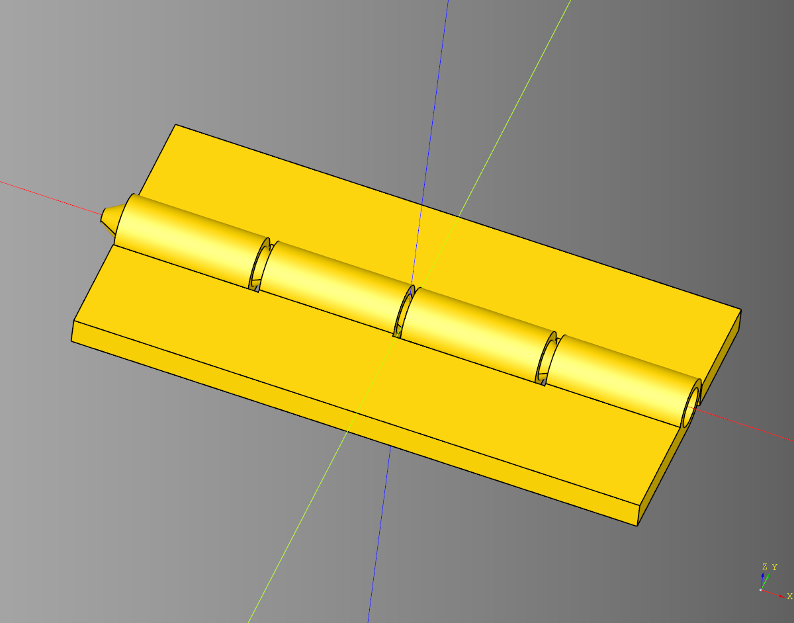
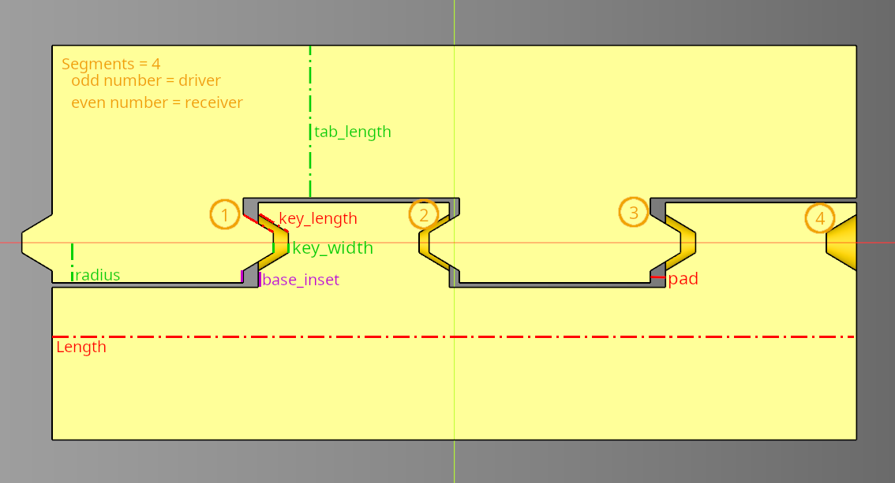
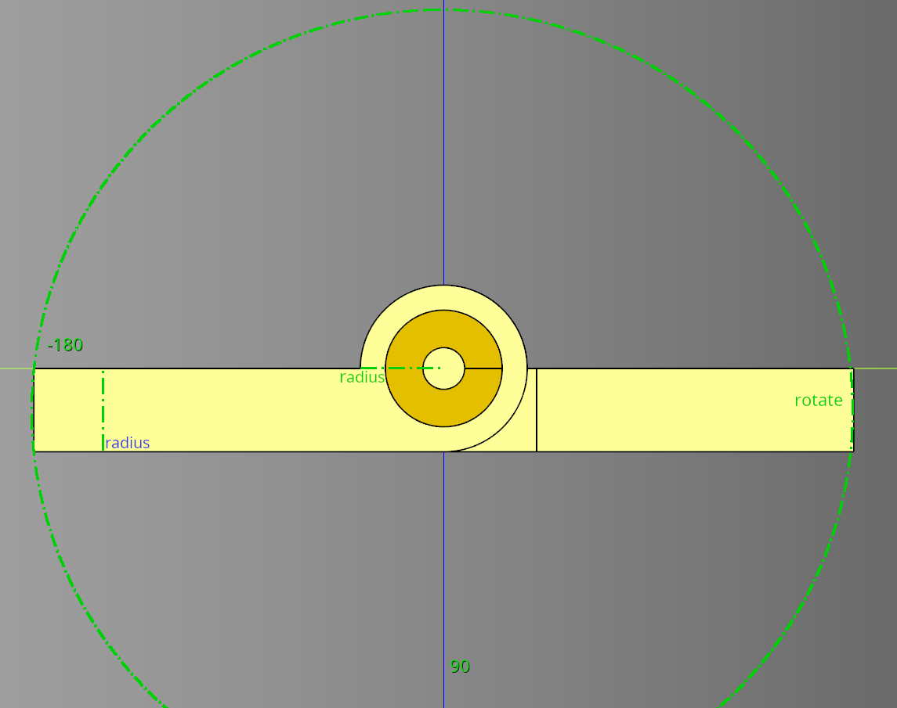

# Hinge Documentation

Print in place hinge.



### Parameters
* **length** = 40
* **radius** = 2
* **segments** = 4 
* **pad** = 1
* **base_inset** = 0.6
* **key_length** = 1.5
* **key_width** = 0.5
* **tab_length** = 10
* **rotate_deg** = 0
* **plate_spacer** = 0.4

### Methods
* **make** - lifecycle, must be called before build.
* **build** - lifecycle

``` python
import cadquery as cq
from cadqueryhelper import Hinge

bp = Hinge()

bp.length = 100
bp.radius = 2
bp.segments = 10 
bp.pad = 1

bp.base_inset = 0.6
bp.key_length = 1.5
bp.key_width = 0.5

bp.tab_length = 10
bp.rotate_deg = 0
bp.plate_spacer = 0.4

bp.make()
hinge_test = bp.build()

#show_object(hinge_test)
cq.exporters.export(hinge_test, 'stl/hinge.stl')
```

<br /><br />


* [source Code](../src/cadqueryhelper/Hinge.py)
* [example](../example/hinge.py)
* [stl](../stl/hinge.stl)