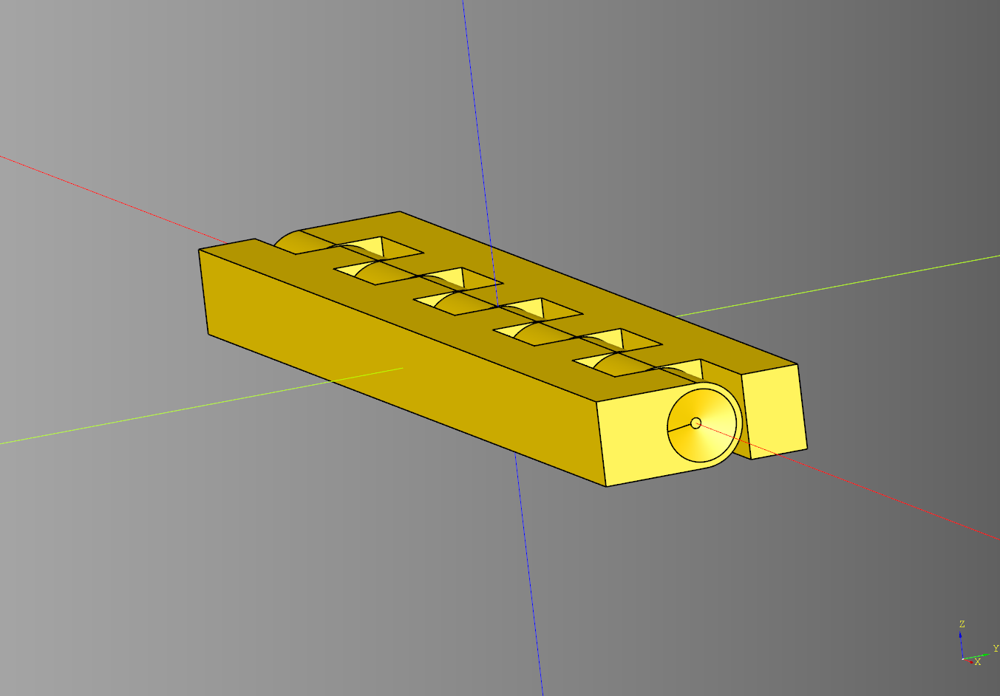
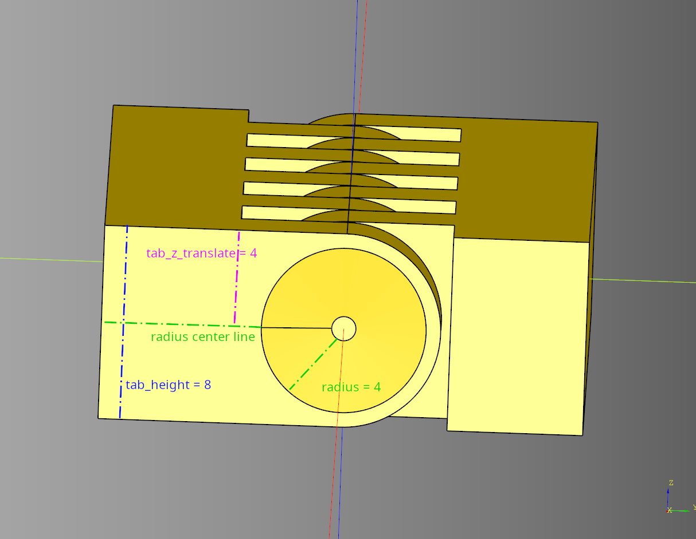
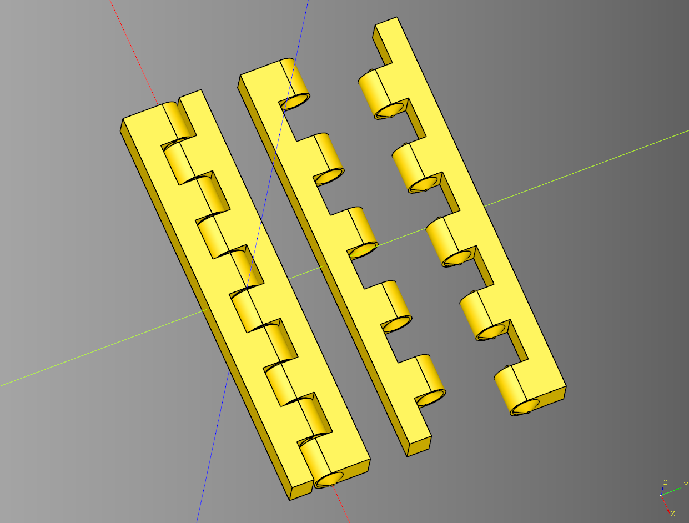

# Hinge Documentation

Print in place hinge.


### Parameters
* **length**: float = 40 - Overall length of the hinge
* **radius**: float = 2 - Radius of the hinge
* **segments**: int = 4 
* **pad**: float = 1
* **base_inset**: float = 0.6
* **key_length**: float = 1.5
* **key_width**: float = 0.5
* **tab_length**: float = 10
* **tab_height**: float|None = None - If set to *None* uses **radius** instead for the tab height
* **tab_z_translate**: float = 0 - Offset of the tab from the midpoint of the hinge diameter.
* **rotate_deg**: float = 0
* **plate_spacer**: float = 0.4
* **render**: Literal['both', 'receiver', 'driver'] - determines which parts of the hinge will be rendered.

### Methods
* **make** - lifecycle, must be called before build.
* **build** - lifecycle

``` python
import cadquery as cq
from cadqueryhelper import Hinge

bp = Hinge()

bp.length = 100
bp.radius = 2
bp.segments = 10 
bp.pad = 1

bp.base_inset = 0.6
bp.key_length = 1.5
bp.key_width = 0.5

bp.tab_length = 10
bp.rotate_deg = 0
bp.plate_spacer = 0.4

bp.make()
hinge_test = bp.build()

show_object(hinge_test)
#cq.exporters.export(hinge_test, 'stl/hinge.stl')
```

<br /><br />


* [source Code](../src/cadqueryhelper/Hinge.py)
* [example](../example/hinge.py)
* [stl](../stl/hinge.stl)

#### Custom Tab Height Example



``` python
import cadquery as cq
from cadqueryhelper import Hinge
bp = Hinge()

bp.length = 100
bp.radius = 4
bp.segments = 10 
bp.pad = 1

bp.base_inset = 0.6
bp.key_length = 1.5
bp.key_width = 0.5

bp.tab_length = 10

#--------------
# Tab height Parameters
bp.tab_height = 8
bp.tab_z_translate = 4
#--------------

bp.rotate_deg = 0 #90
bp.plate_spacer = 0.4

bp.make()
hinge_test = bp.build()

show_object(hinge_test)
```



* [example](../example/hinge_larger_tab.py)
* [stl](../stl/hinge_larger_tab.stl)

#### Render Example
``` python
import cadquery as cq
from cadqueryhelper import Hinge

bp = Hinge()

bp.length = 100
bp.radius = 4
bp.segments = 10 
bp.pad = 1

bp.base_inset = 0.6
bp.key_length = 1.5
bp.key_width = 0.5

bp.tab_length = 10
bp.tab_height = 8
bp.tab_z_translate = 4
bp.rotate_deg = 0 #90
bp.plate_spacer = 0.4

bp.render = "both"
bp.make()

hinge_test = bp.build()
scene = cq.Workplane("XY").union(hinge_test)

bp.render = "driver"
bp.make()
hinge_driver = bp.build()
scene = scene.add(hinge_driver.translate((0,50,0)))

bp.render = "receiver"
bp.make()
hinge_receiver = bp.build()
scene = scene.add(hinge_receiver.translate((0,30,0)))


show_object(scene)
```



* [example](../example/hinge_render.py)
* [stl](../stl/hinge_render.stl)