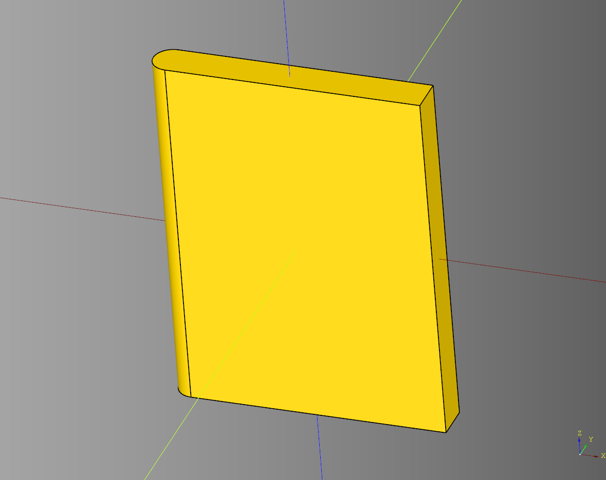
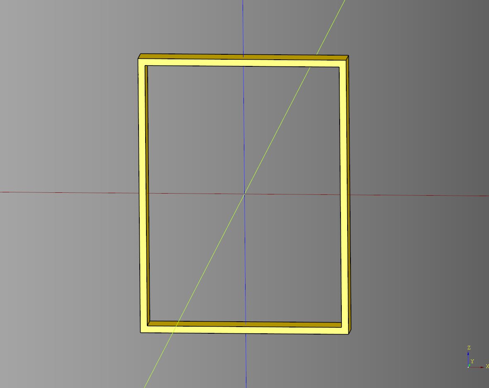
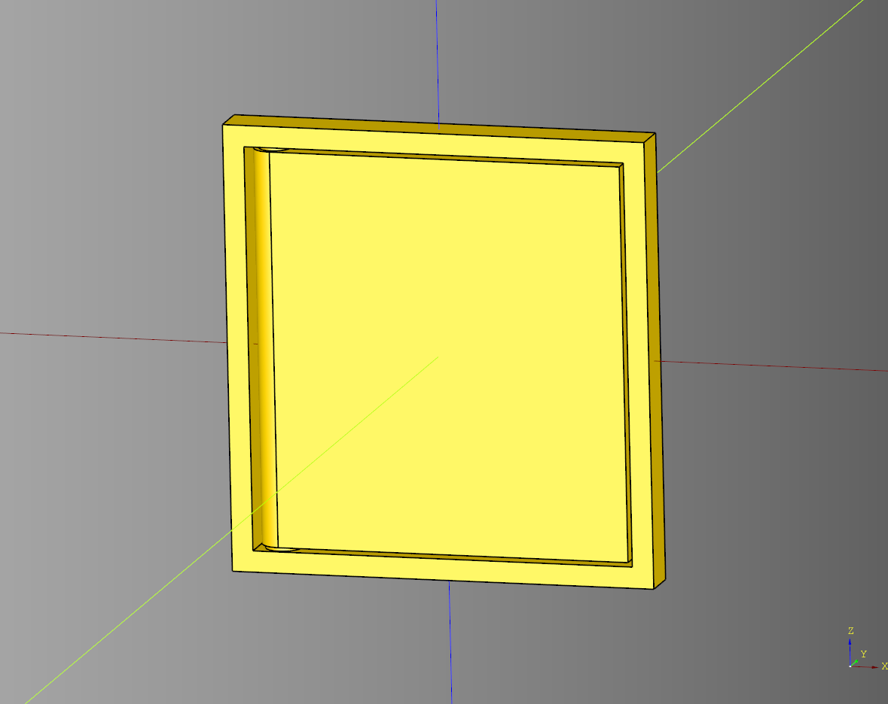
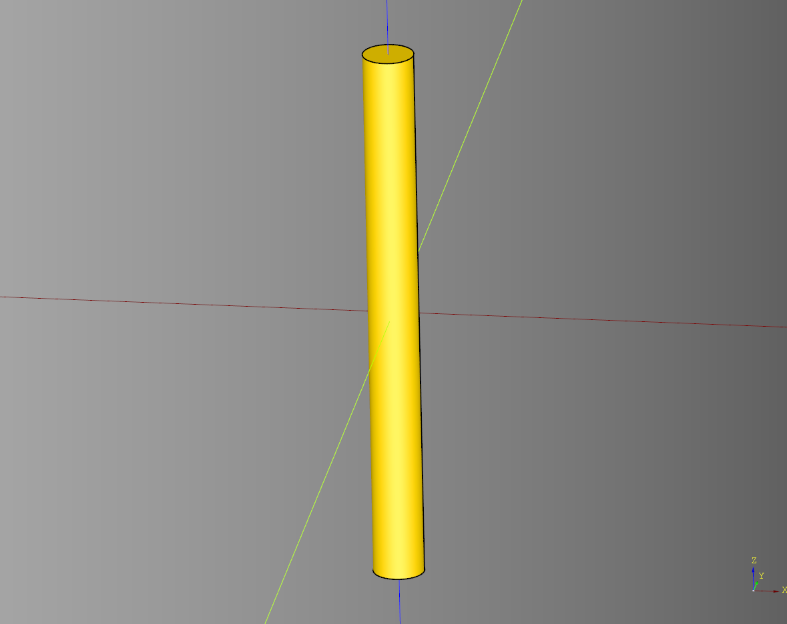

# Hinge Documentation
---

- [Hinge Documentation](#hinge-documentation)
  - [Hinge](#hinge)
    - [Parameters](#parameters)
    - [Methods](#methods)
      - [Custom Tab Height Example](#custom-tab-height-example)
      - [Render Example](#render-example)
  - [Simple Door](#simple-door)
    - [parameters](#parameters-1)
    - [blueprints](#blueprints)
  - [Simple Frame](#simple-frame)
    - [parameters](#parameters-2)
  - [Simple Hinge](#simple-hinge)
    - [parameters](#parameters-3)
  - [Simple Pivot](#simple-pivot)
    - [parameters](#parameters-4)

---

## Hinge

Print in place hinge.


### Parameters
* **length**: float = 40 - Overall length of the hinge
* **radius**: float = 2 - Radius of the hinge
* **segments**: int = 4 
* **pad**: float = 1
* **base_inset**: float = 0.6
* **key_length**: float = 1.5
* **key_width**: float = 0.5
* **tab_length**: float = 10
* **tab_height**: float|None = None - If set to *None* uses **radius** instead for the tab height
* **tab_z_translate**: float = 0 - Offset of the tab from the midpoint of the hinge diameter.
* **rotate_deg**: float = 0
* **plate_spacer**: float = 0.4
* **render**: Literal['both', 'receiver', 'driver'] - determines which parts of the hinge will be rendered.
* **invert**: bool - Inverts the driver and receiver. Defaults to *False*.

### Methods
* **make** - lifecycle, must be called before build.
* **build** - lifecycle

``` python
import cadquery as cq
from cadqueryhelper.hinge import Hinge

bp = Hinge()

bp.length = 100
bp.radius = 2
bp.segments = 10 
bp.pad = 1

bp.base_inset = 0.6
bp.key_length = 1.5
bp.key_width = 0.5

bp.tab_length = 10
bp.rotate_deg = 0
bp.plate_spacer = 0.4

bp.make()
hinge_test = bp.build()

show_object(hinge_test)
#cq.exporters.export(hinge_test, 'stl/hinge.stl')
```

<br /><br />


* [source Code](../src/cadqueryhelper/hinge/Hinge.py)
* [example](../example/hinge/hinge.py)
* [stl](../stl/hinge.stl)

#### Custom Tab Height Example


``` python
import cadquery as cq
from cadqueryhelpe.hinge import Hinge
bp = Hinge()

bp.length = 100
bp.radius = 4
bp.segments = 10 
bp.pad = 1

bp.base_inset = 0.6
bp.key_length = 1.5
bp.key_width = 0.5

bp.tab_length = 10

#--------------
# Tab height Parameters
bp.tab_height = 8
bp.tab_z_translate = 4
#--------------

bp.rotate_deg = 0 #90
bp.plate_spacer = 0.4

bp.make()
hinge_test = bp.build()

show_object(hinge_test)
```


* [example](../example/hinge/hinge_larger_tab.py)
* [stl](../stl/hinge_larger_tab.stl)

#### Render Example
``` python
import cadquery as cq
from cadqueryhelper.hinge import Hinge

bp = Hinge()

bp.length = 100
bp.radius = 4
bp.segments = 10 
bp.pad = 1

bp.base_inset = 0.6
bp.key_length = 1.5
bp.key_width = 0.5

bp.tab_length = 10
bp.tab_height = 8
bp.tab_z_translate = 4
bp.rotate_deg = 0 #90
bp.plate_spacer = 0.4

bp.render = "both"
bp.make()

hinge_test = bp.build()
scene = cq.Workplane("XY").union(hinge_test)

bp.render = "driver"
bp.make()
hinge_driver = bp.build()
scene = scene.add(hinge_driver.translate((0,50,0)))

bp.render = "receiver"
bp.make()
hinge_receiver = bp.build()
scene = scene.add(hinge_receiver.translate((0,30,0)))


show_object(scene)
```


* [example](../example/hinge/hinge_render.py)
* [stl](../stl/hinge_render.stl)

---
## Simple Door
### parameters
* length: float
* width: float
* height: float
* rotate_type: Literal['full','front','back']

### blueprints
* bp_door:Base|None = None


``` python
import cadquery as cq
from cadqueryhelper.hinge import SimpleDoor

bp_door = SimpleDoor()
bp_door.length = 30
bp_door.width = 4
bp_door.height = 40
bp_door.rotate_type = 'full'
bp_door.make()
ex_door = bp_door.build()

show_object(ex_door)
```



* [source Code](../src/cadqueryhelper/hinge/SimpleDoor.py)
* [example](../example/hinge/simple_door.py)
* [stl](../stl/hinge_simple_door.stl)

---
## Simple Frame

### parameters
* length: float
* width: float
* height: float
* frame_width: float

``` pyhon
import cadquery as cq
from cadqueryhelper.hinge import SimpleFrame

bp_frame = SimpleFrame()
bp_frame.length = 30
bp_frame.width = 4
bp_frame.height = 40
bp_frame.frame_width = 1
bp_frame.make()
ex_frame = bp_frame.build()

show_object(ex_frame) 
```



* [source Code](../src/cadqueryhelper/hinge/SimpleFrame.py)
* [example](../example/hinge/simple_frame.py)
* [stl](../stl/hinge_simple_frame.stl)

---

## Simple Hinge

### parameters
* length: float
* width: float
* height: float
* margin: float
* frame_width: float
* pivot_diameter: float
* pivot_height: float|None
* door_width: float|None
* rotate_type: Literal['full','front','back']
* rotate: float

``` python
import cadquery as cq
from cadqueryhelper.hinge import SimpleHinge

bp_hinge = SimpleHinge()
bp_hinge.length = 40
bp_hinge.width = 4
bp_hinge.height = 42
bp_hinge.margin = 0.4
bp_hinge.frame_width = 2
bp_hinge.pivot_diameter = 3
bp_hinge.pivot_height = bp_hinge.height - 1.5
bp_hinge.door_width = None
bp_hinge.rotate = 0
bp_hinge.rotate_type = "full"
bp_hinge.make()
ex_hinge = bp_hinge.build()

show_object(ex_hinge)
```



* [source Code](../src/cadqueryhelper/hinge/SimpleHinge.py)
* [example](../example/hinge/simple_hinge.py)
* [stl](../stl/hinge_simple_hinge.stl)

---
## Simple Pivot

### parameters
* diameter: float
* height: float
* margin: float

``` python
import cadquery as cq
from cadqueryhelper.hinge import SimplePivot

bp_pivot = SimplePivot()
bp_pivot.diameter = 4
bp_pivot.height = 43
bp_pivot.make()
ex_pivot= bp_pivot.build()

show_object(ex_pivot)  
```



* [source Code](../src/cadqueryhelper/hinge/SimplePivot.py)
* [example](../example/hinge/simple_pivot.py)
* [stl](../stl/hinge_simple_pivot.stl)

---