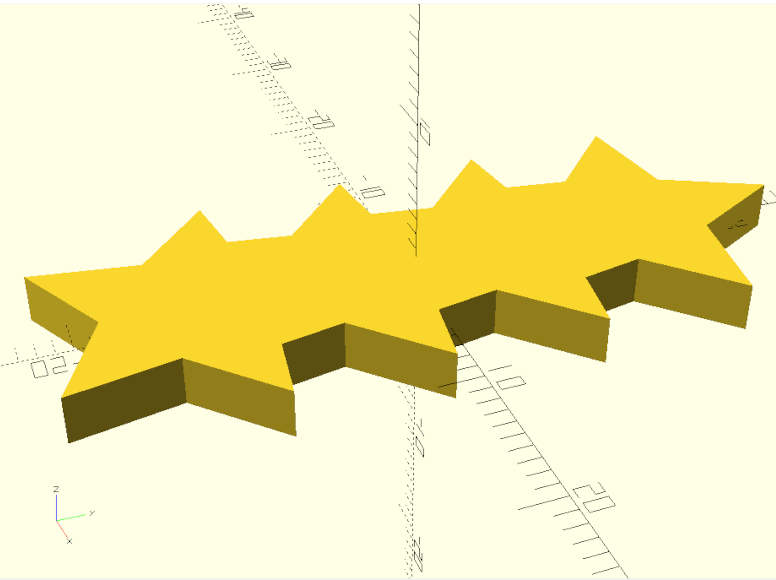
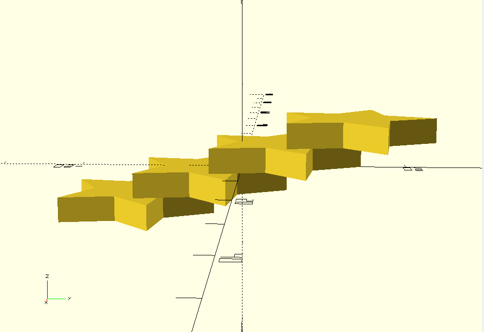
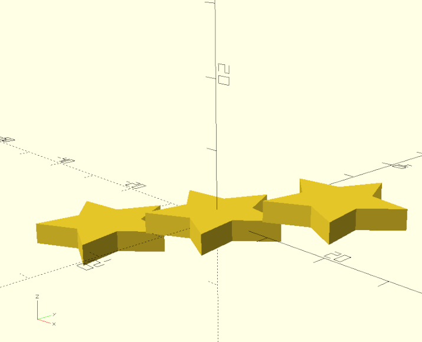
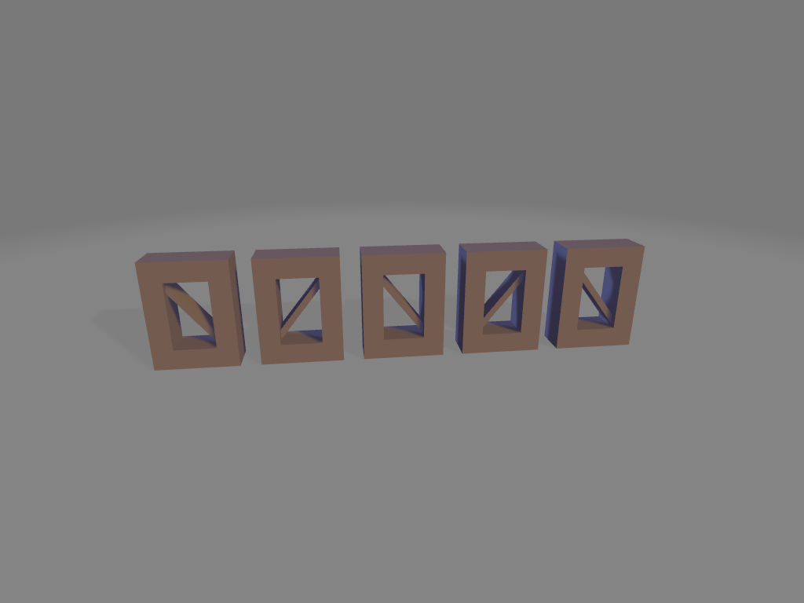

# Series Documentation

## Series
### Parameters
* shape:cq.Workplane, 
* size:int = 5, 
* length_offset:float|None = None, 
* width_offset:float|None = None, 
* height_offset:float|None = None, 
* skip_last:int = 0, 
* skip_first:int = 0, 
* operation: Callable[[cq.Workplane, int, int, dict], cq.Workplane]|None=None,
* union:bool=False

### Returns
* cq.Workplane

simple loop that repeats the given shape n-number of times based on the *size* parameter.

* [source](../src/cadqueryhelper/series.py)
* [example](../example/series.py)
* [stl](../stl/series.stl)

### Examples

#### Star series repeated over the y-axis
``` python
import cadquery as cq
from cadqueryhelper import shape
from cadqueryhelper import series

if __name__ == "__main__":
    star = shape.star()

    st_series = series(shape = star, length_offset=None, width_offset=-11, height_offset=None, size=4)
    cq.exporters.export(st_series,'stl/series.stl')

    if st_series.metadata:
        print(st_series.metadata)
```


<br />

#### Star series repeated over the y and z-axis
``` python
  series(shape = star, length_offset=None, width_offset=-11, height_offset=0, size=4)
```
<br />

#### Star series repeated over the x, y and z-axis
``` python
  series(shape = star, length_offset=1, width_offset=-11, height_offset=0, size=3)
```
<br />


### Series with operation applied
``` python
import cadquery as cq
from cadqueryhelper import shape
from cadqueryhelper import series

# yoinked from cqterrain
def frame_shape(length=20, width = 4, height = 40, frame_width=3):
    outline = cq.Workplane("XY").box(length, width, height)
    inline =  cq.Workplane("XY").box(length-(frame_width*2), width, height-(frame_width*2))
    return outline.cut(inline)

# yoinked from cqterrain
def rail_operation(tile, size, index, bounding_box):
    rail_rotation = 0
    if index % 2 == 1:
        rail_rotation = 180
    win_rail = (
        shape.rail(length=12-3, width=5-2, height=16-3)
        .rotate((0,0,1),(0,0,0),rail_rotation)
    )

    # copy the tile instance to a new workplane
    new_tile = cq.Workplane("XY").add(tile).add(win_rail)
    return new_tile

# make the frame instance
frame = frame_shape(length=12, width = 5, height = 16)

# make the series of frames
# appliy the operation in order to make alternating internal rail patern
frame_series = series(shape=frame, size=5, length_offset=3, operation=rail_operation)

cq.exporters.export(frame_series,'stl/seriesOperation.stl')
```

* [example](../example/seriesOperation.py)
* [stl](../stl/seriesOperation.stl)

<br />
