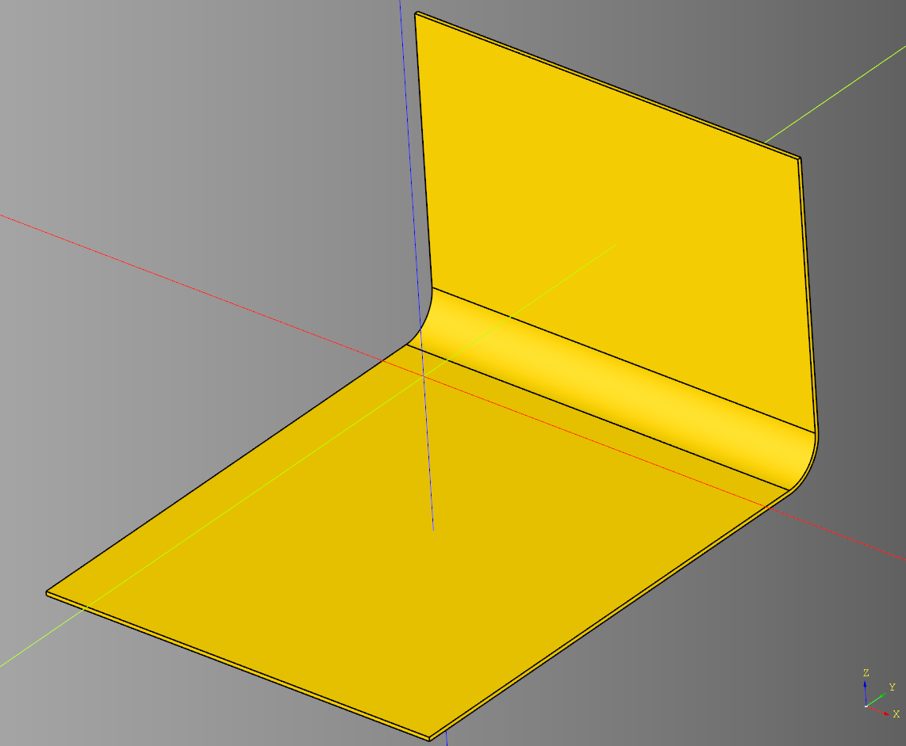
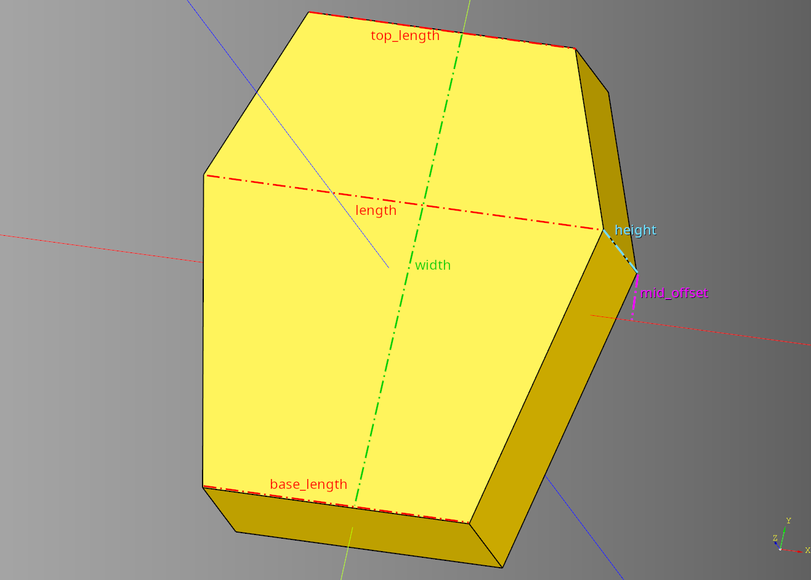
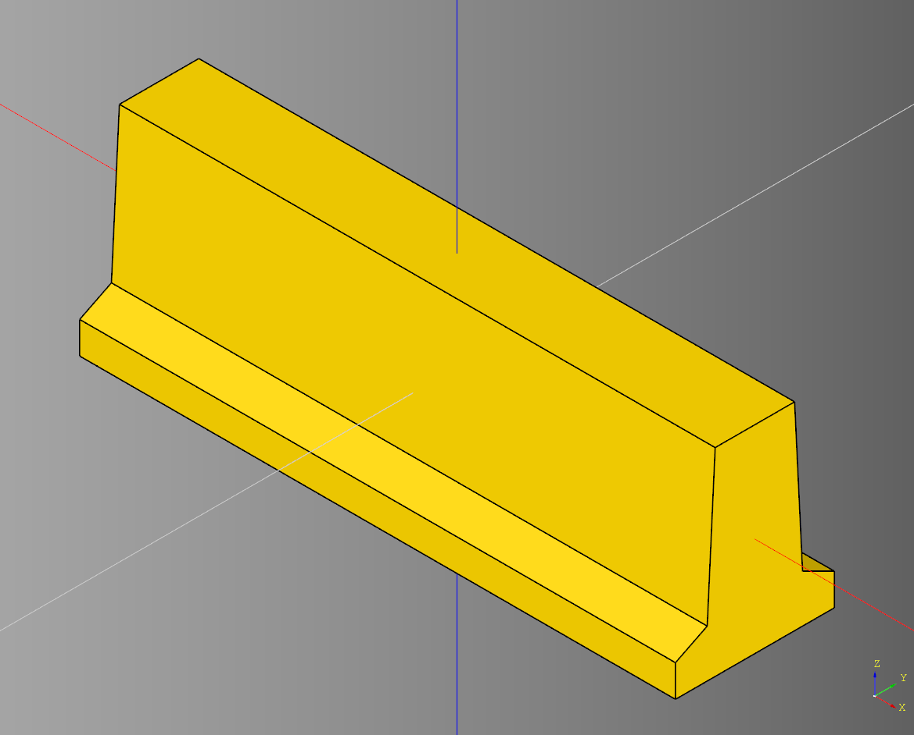
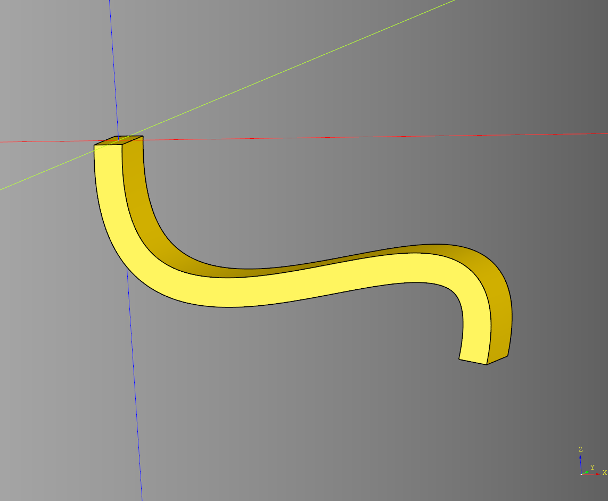
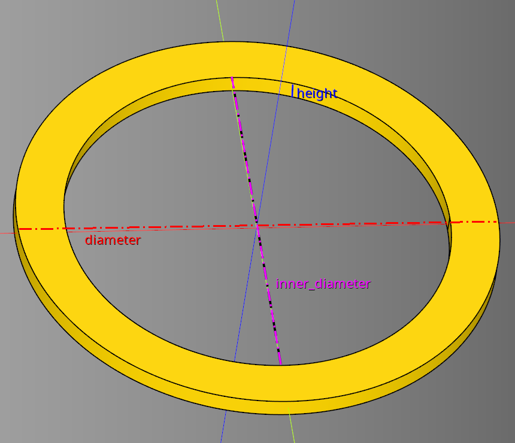
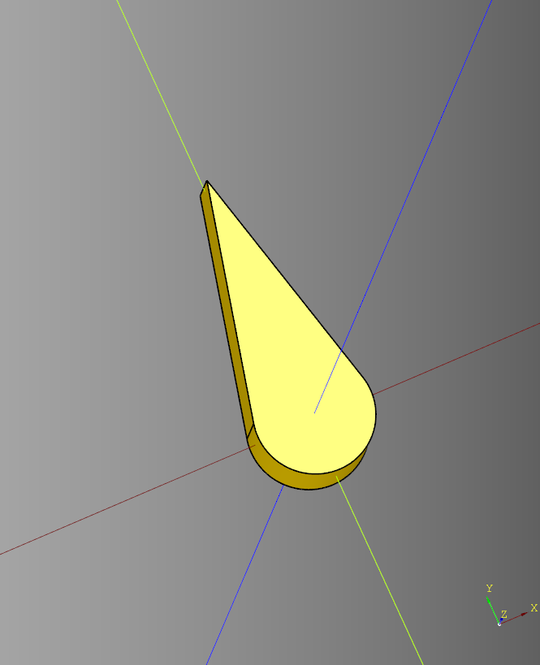
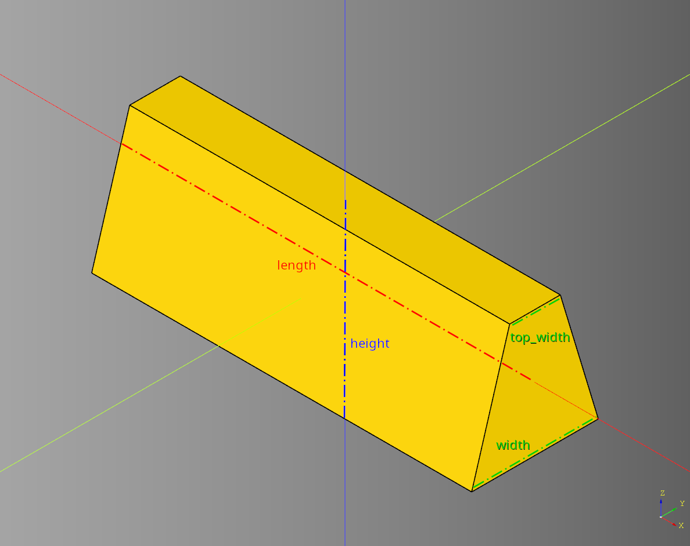
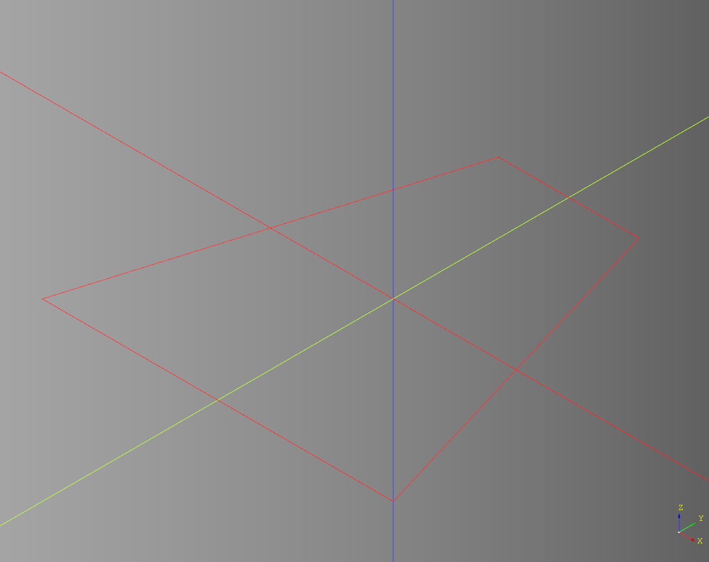
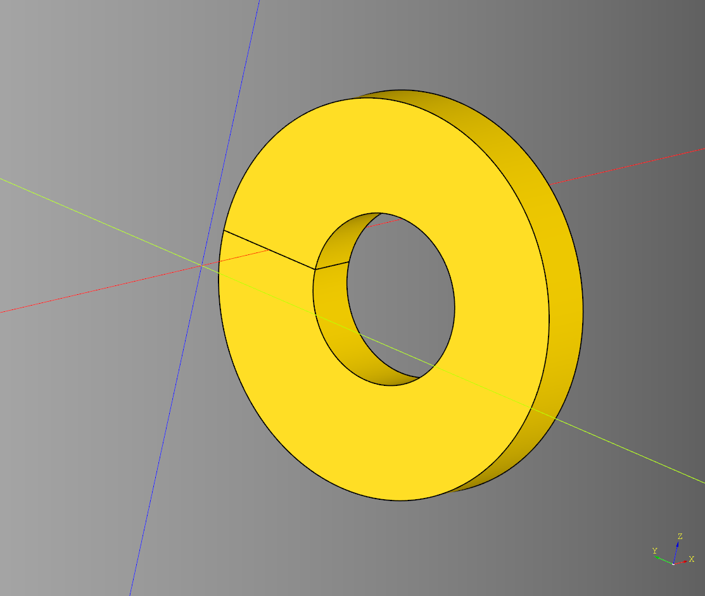
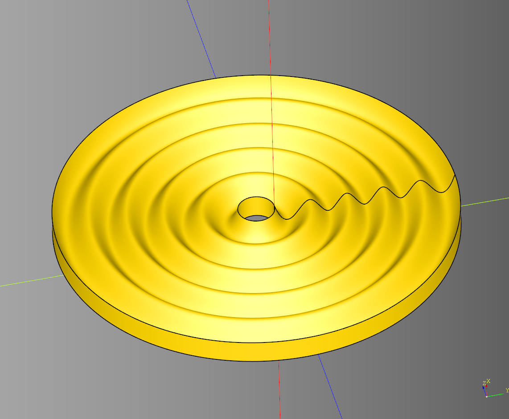

# Shape Documentation


## Example Usage

``` python
import cadquery as cq #main cadquery library
from cadqueryhelper import shape # The shape library this document is about

part = shape.arrow() # Generate a solid using it's default values
cq.exporters.export(part,'stl/arrow.stl') # write the file to an stil file

```

The code above:
* Imports the required libraries.
* Generates a solid using default setting.
* Exports the solid to a file.
* Prints the parts metadata to the console.

#### Generated Output
<br />

----

## Shape Conventions
* **Length** is along the **X** axis
* **Width** is along the **Y** axis
* **Height** is along the **Z** axis
* Shapes are centered along the X, Y, and Z axis.

---

# Shapes

* [Arch Pointed](#arch-pointed)
* [Arch Round](#arch-round)
* [Arrow](#arrow)
* [Backdrop](#backdrop)
* [Chevron](#chevron)
* [Coffin](#coffin)
* [Cone](#cone)
* [Corner Join](#corner-join)
* [Cross](#cross)
* [Cube](#cube)
* [Cylinder](#cylinder)
* [Diamond](#diamond)
* [I-Beam](#i-beam)
* [Jersey Barrier](#jersey-barrier)
* [Lightning](#lightning)
* [Pinwheel](#pinwheel)
* [Pipe](#pipe)
* [Regular Polygon](#regular-polygon)
* [Rhombus](#rhombus)
* [Ring](#ring)
* [Sphere](#sphere)
* [Start](#start)
* [Trapezoid](#trapezoid)
* [Vase](#vase)

---

## Arch Pointed
### Parameters
* length
* width
* height
* inner_height

``` python
import cadquery as cq
from cadqueryhelper.shape import backdrop

result = shape.arch_pointed(
  length=30,
  width=5,
  height=50,
  inner_height=25
)

show_object(result)
```

<br />

* [source](../src/cadqueryhelper/shape/arch.py)
* [example](../example/shape/arch_pointed.py)
* [stl](../stl/shape_arch_pointed.stl)

---


## Arch Round
### Parameters
* length
* width
* height

``` python
import cadquery as cq
from cadqueryhelper.shape import backdrop

result = shape.arch_round(length=30, width=5, height=50)

show_object(result)
```

<br />

* [source](../src/cadqueryhelper/shape/arch.py)
* [example](../example/shape/arch_round.py)
* [stl](../stl/shape_arch_round.stl)

---

## Arrow
### Parameters
* length
* inner_length
* width
* width_outset
* height

``` python
import cadquery as cq
from cadqueryhelper.shape import backdrop

result = shape.arrow(
  length=10,
  inner_length=5,
  width=5,
  width_outset=2,
  height=3
)

show_object(result)
```

<br />

* [source](../src/cadqueryhelper/shape/arrow.py)
* [example](../example/shape/arrow.py)
* [stl](../stl/shape_arrow.stl)


### Examples

#### Negative width_outset

``` python
import cadquery as cq
from cadqueryhelper.shape import backdrop

result = shape.arrow(width_outset=-1)

show_object(result)
```

<br />

---

## Backdrop
### Parameters
* length:float = 200 
* width:float = 250 
* height:float = 150
* thickness:float = 4
* operation:str = 'fillet' #chamfer, fillet
* operation_dist:float = 20

``` python
import cadquery as cq
from cadqueryhelper.shape import backdrop

result = backdrop(
    length = 200, 
    width = 250, 
    height = 150,
    thickness = 2,
    operation= 'fillet',#'chamfer', 'fillet', None
    operation_dist = 20
)

show_object(result)
```

<br />

* [source](../src/cadqueryhelper/shape/backdrop.py)
* [example](../example/shape/backdrop.py)
* [stl](../stl/shape_backdrop.stl)

---

## Chevron
### Parameters
* length
* width
* height
* inner_width
* alt

``` python
import cadquery as cq
from cadqueryhelper import shape

result = shape.chevron(
  length=10,
  width=7,
  height=2,
  inner_width=3,
  alt=False
)

show_object(result)
```

<br />

* [source](../src/cadqueryhelper/shape/chevron.py)
* [example](../example/shape/chevron.py)
* [stl](../stl/shape_chevron.stl)


### Example
#### Chevron with alt set to True

``` python
import cadquery as cq
from cadqueryhelper import shape

alt = shape.chevron(
  length=10,
  width=7,
  height=2,
  inner_width=3,
  alt=True
)

show_object(alt)
```

<br />

* [stl](../stl/shape_chevron_alt.stl)

---

## Coffin
### Parameters
* length - Length between the two mid points
* width - Distance between the top and base
* height - Extruded height of the face, can be falsy
* top_length - Length of the top
* base_length - Length of the base
* mid_offset - Middle points distance from the width center. Can be positive or negative.

``` python
import cadquery as cq
from cadqueryhelper import shape

result = shape.coffin(
    length = 30, 
    width = 36,
    height =10,
    top_length = 20,
    base_length = 20, 
    mid_offset = 5
)

show_object(result)
```

<br />

* [source](../src/cadqueryhelper/shape/coffin.py)
* [example](../example/shape/coffin.py)
* [stl](../stl/shape_coffin.stl)

---

## Cone
### Parameters
* radius - base
* radius_top
* height

``` python
import cadquery as cq
from cadqueryhelper import shape

result = shape.cone(radius=1, radius_top=0, height=2)

show_object(result)
```

<br />

* [source](../src/cadqueryhelper/shape/cone.py)
* [example](../example/shape/cone.py)
* [stl](../stl/shape_cone.stl)

---

## Corner Join
### parameters
* length
* width
* height
* side_width = 1 
* corner_chamfer = 0

``` python
import cadquery as cq
from cadqueryhelper import shape

result = shape.corner_join(
    length = 10,
    width = 6,
    height = 5,
    side_width = 1,
    corner_chamfer = 1
)

show_object(result)
```

<br />

* [source](../src/cadqueryhelper/shape/cornerJoin.py)
* [example](../example/shape/cornerJoin.py)
* [stl](../stl/shape_cornerJoin.stl)

---


## Cross
### Parameters
* length
* width
* height
* cross_length
* cross_width
* x_translate - Distance of length crossbeam from center.
* y_translate - Distance of width crossbeam from center.

``` python
import cadquery as cq
from cadqueryhelper import shape

result = shape.cross(
  length=10,
  width=10,
  height=2,
  cross_length=1,
  cross_width=1,
  x_translate=0,
  y_translate=0
)

show_object(result)
```

<br />

* [source](../src/cadqueryhelper/shape/cross.py)
* [example](../example/shape/cross.py)
* [stl](../stl/shape_cross.stl)

### Examples

#### Move crossbeams from center

``` python
import cadquery as cq
from cadqueryhelper import shape

result = shape.cross(
  cross_length=2,
  cross_width=2,
  x_translate=-1,
  y_translate=2.5
)

show_object(result)
```

<br />

---

## Cube
### Parameters
* length
* width
* height

``` python
import cadquery as cq
from cadqueryhelper import shape

result = shape.cube(length=5, width=5, height=5)

show_object(result)
```

<br />

* [source](../src/cadqueryhelper/shape/cube.py)
* [example](../example/shape/cube.py)
* [stl](../stl/shape_cube.stl)


---

## Cylinder
### Parameters
* radius
* height

``` python
import cadquery as cq
from cadqueryhelper import shape

result = shape.cylinder(radius=2.5, height=5)

show_object(result)
```

<br />

* [source](../src/cadqueryhelper/shape/cylinder.py)
* [example](../example/shape/cylinder.py)
* [stl](../stl/shape_cylinder.stl)

---
## Diamond
### Parmeters
* length
* width
* height

``` python
import cadquery as cq
from cadqueryhelper import shape

result = shape.diamond(length=10, width=5, height=3)

show_object(result)
```

<br />

* [source](../src/cadqueryhelper/shape/diamond.py)
* [example](../example/shape/diamond.py)
* [stl](../stl/shape_diamond.stl)
---

## I-Beam
### Parameters
* length
* width
* height
* web_thickness
* flange_thickness
* join_distance

``` python
import cadquery as cq
from cadqueryhelper import shape

result = shape.i_beam(
  length=30,
  width=5,
  height=10,
  web_thickness=2,
  flange_thickness=2,
  join_distance=1.3
)

show_object(result)
```


<br /><br />
<br />

* [source](../src/cadqueryhelper/shape/iBeam.py)
* [example](../example/shape/iBeam.py)
* [stl](../stl/shape_ibeam.stl)

### Wiki
* [Wikpedia](https://en.wikipedia.org/wiki/I-beam)
* [Wiki Image](https://en.wikipedia.org/wiki/File:I-BeamCrossSection.svg)

---

## Jersey Barrier
### Parameters
* width:float = 10,
* height:float = 10,
* base_height:float = 2,
* middle_width_inset:float = -2,
* middle_height:float = 2,
* top_width_inset:float = -1

``` python
import cadquery as cq
from cadqueryhelper.shape import jersey_barrier

result = jersey_barrier(
    length=75,
    width = 20,
    height = 25,
    base_height = 4,
    middle_width_inset = -4,
    middle_height = 2,
    top_width_inset = -1
)

show_object(result)
```

<br />

* [source](../src/cadqueryhelper/shape/jersey_barrier.py)
* [example](../example/shape/jersey_barrier.py)
* [stl](../stl/shape_jersey_barrier.stl)

---

## Lightning
### Parameters
* length
* width
* height
* x_dist
* y_dist

``` python
import cadquery as cq
from cadqueryhelper import shape

result = shape.lightning(
    length = 25,
    width = 50,
    height = 5,
    x_dist = 3,
    y_dist = 6
)

show_object(result)
```

<br />

* [source](../src/cadqueryhelper/shape/lightning.py)
* [example](../example/shape/lightning.py)
* [stl](../stl/shape_lightning.stl)

---

## Pinwheel
### Parameters
* count
* height
* ring_params - list of ring param dictionaries
  * radius
  * start_angle

``` python
import cadquery as cq
from cadqueryhelper import shape

ring_params = []
ring_params.append({"radius": 150, "start_angle":0})
ring_params.append({"radius":100,"start_angle":30})
ring_params.append({"radius":30,"start_angle":80})
result = shape.pinwheel(count = 10, height = 3, ring_params = ring_params)

show_object(result)
```

<br />
<br />

* [source](../src/cadqueryhelper/shape/pinwheel.py)
* [example](../example/shape/pinwheel.py)
* [stl](../stl/shape_pinwheel.stl)

---

## Pipe
### Parameters
* shape:cq.Workplane = cq.Workplane("XY").circle(5), 
* pts:list[tuple[int,int]] = [(0,0), (20,-20), (50,-20), (50,-30)]

``` python
import cadquery as cq
from cadqueryhelper.shape import pipe

test_shape = cq.Workplane('XY').rect(4,8)
pst = pts = [(0,0), (20,-20), (50,-20), (50,-30)]
result = pipe(test_shape, pts)

show_object(result)
```

<br />

* [source](../src/cadqueryhelper/shape/pipe.py)
* [example](../example/shape/pipe.py)
* [stl](../stl/shape_pipe.stl)

---
## Rail
### Parameters
* length
* width
* height
* inner_height

``` python
import cadquery as cq
from cadqueryhelper import shape

result = shape.rail(length=6, width=1, height=5, inner_height=1.5)

show_object(result)
```


<br />

* [source](../src/cadqueryhelper/shape/rail.py)
* [example](../example/shape/rail.py)
* [stl](../stl/shape_rail.stl)

---
## Regular Polygon
[wikipedia](https://en.wikipedia.org/wiki/Regular_polygon)
### Parameters
* radius
* sides
* height

``` python
import cadquery as cq
from cadqueryhelper import shape

result = shape.regular_polygon(radius=10, sides=6, height=5)

show_object(result)
```

<br />

* [source](../src/cadqueryhelper/shape/regularPolygon.py)
* [example](../example/shape/hexagon.py)
* [stl](../stl/shape_hexagon.stl)


---
## Rhombus
### Parameters
* width
* offset
* height

``` python
import cadquery as cq
from cadqueryhelper import shape

result = shape.rhombus(width=10, offset=4, height=5)

show_object(result)
```

<br />

* [source](../src/cadqueryhelper/shape/rhombus.py)
* [example](../example/shape/rhombus.py)
* [stl](../stl/shape_rhombus.stl)

---


## Ring
### Parameters
* diameter
* inner_diameter
* height

``` python
import cadquery as cq
from cadqueryhelper import shape

ex_ring = shape.ring(
    diameter = 100,
    inner_diameter = 80,
    height = 4
)

show_object(ex_ring)
```

<br />

* [source](../src/cadqueryhelper/shape/ring.py)
* [example](../example/shape/ring.py)
* [stl](../stl/shape_ring.stl)

---


## Sphere
### Parameters
* radius

``` python
import cadquery as cq
from cadqueryhelper import shape

result = shape.sphere(radius=5)

show_object(result)
```

<br />

* [source](../src/cadqueryhelper/shape/sphere.py)
* [example](../example/shape/sphere.py)
* [stl](../stl/shape_sphere.stl)

---
## Star
### Parameters
* outer_radius
* inner_radius
* points
* height

``` python
import cadquery as cq
from cadqueryhelper import shape

result = shape.star(
  outer_radius=10,
  inner_radius=5,
  points=5,
  height=3
)

show_object(result)
```

<br />

* [source](../src/cadqueryhelper/shape/star.py)
* [example](../example/shape/star.py)
* [stl](../stl/shape_star.stl)

---

## Teardrop
### Parameters
* diameter:float
* length:float
* height:float|None

``` python
import cadquery as cq
from cadqueryhelper.shape import teardrop

example = teardrop(
    diameter = 5,
    length= 8,
    height = 3
)

show_object(example)
```

<br />

* [source](../src/cadqueryhelper/shape/teardrop.py)
* [example](../example/shape/teardrop.py)
* [stl](../stl/shape_teardrop.stl)

---

## Trapezoid
### Parameters
* length:float|None = 75
* width:float = 25
* height:float = 25
* top_width:float = 10

``` python
import cadquery as cq
from cadqueryhelper.shape import trapezoid

result = trapezoid(
    length = 75,
    width = 25,
    height = 25,
    top_width = 10
)

show_object(result)
```

<br />

* [source](../src/cadqueryhelper/shape/trapezoid.py)
* [example](../example/shape/trapezoid.py)
* [stl](../stl/shape_trapezoid.stl)

Note - if given a length of zero or None will instead return the trapezoid wires.

``` python
import cadquery as cq
from cadqueryhelper.shape import trapezoid

result = trapezoid(
    length = None,
    width = 25,
    height = 25,
    top_width = 10
)

show_object(result)
```

<br />

---

## Vase
Extrudes a given face into a cirular path.

### Parameters
* shape:cq.Workplane, 
* workplane_axis:str = "YZ", #'XY', 'YZ', 'XZ'
* radius:float = 1, 
* angle:float = 0, 
* rotation_angle:float = 0

### Simple Example
Extrude a rectangle

``` python
import cadquery as cq
from cadqueryhelper.shape import vase

test_shape = cq.Workplane("XY").rect(4,8)
result = vase(
    test_shape, 
    workplane_axis = "YZ",
    radius = 10, 
    angle=0, 
    rotation_angle=0
)

show_object(result)
```

<br />


### Sine example
Extrude a sine wave

``` python
import cadquery as cq
from cadqueryhelper.shape import vase
from cadqueryhelper.wave import sine

shape_wave = sine(
    length=80,
    width=20,
    height=0,
    segment_length=15,
    inner_width=5
)

result = vase(
    shape_wave, 
    workplane_axis = "YZ",
    radius = 10, 
    angle=0, 
    rotation_angle=0
)

show_object(result)
```
<br />

* [source](../src/cadqueryhelper/shape/vase.py)
* [example](../example/shape/vase.py)
* [stl](../stl/shape_vase_ripple.stl)