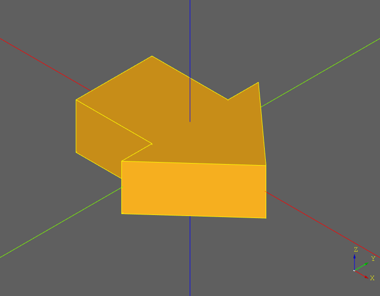
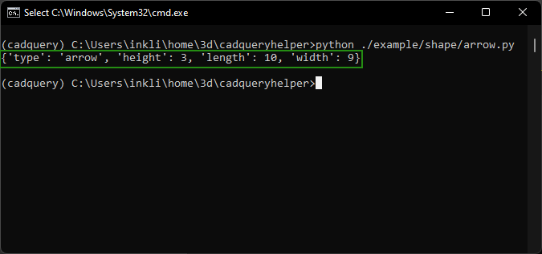
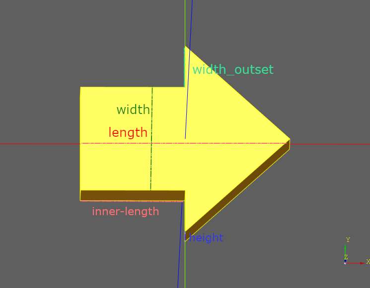
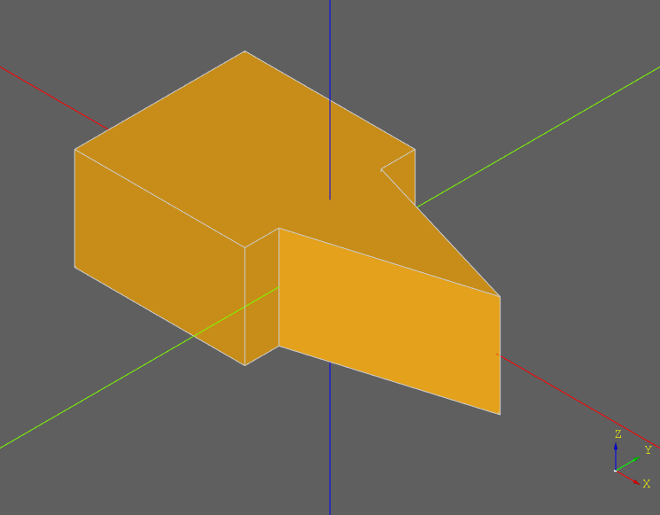
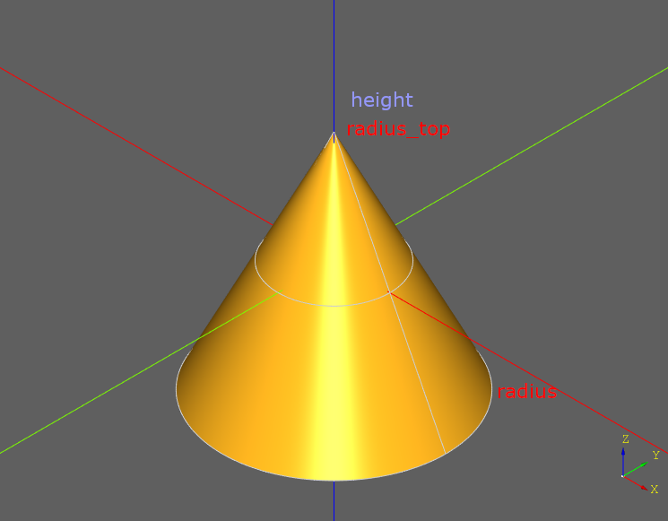
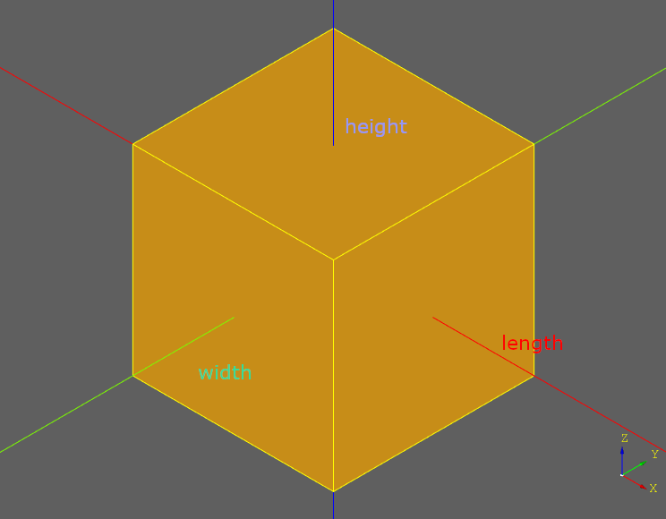
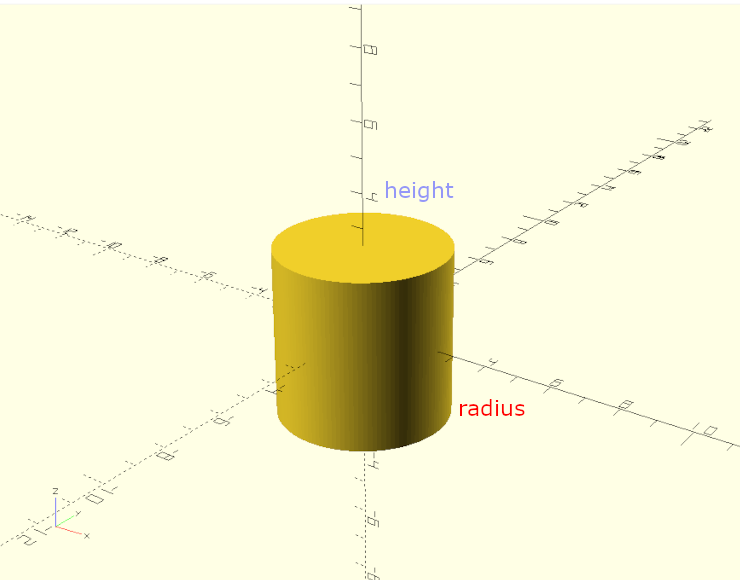

# Shape Documentation

## Example Usage

``` python
import cadquery as cq #main cadquery library
from cadqueryhelper import shape # The shape library this document is about

part = shape.arrow() # Generate a solid using it's default values
cq.exporters.export(part,'out/arrow.stl') # write the file to an stil file

if part.metadata:
    print(part.metadata) # print the parts bounding box
```

The code above:
* Imports the required libraries.
* Generates a solid using default setting.
* Exports the solid to a file.
* Prints the parts metadata to the console.

#### Generated Output


Metadata / bounding box
<br />

----

## Shape Conventions
* **Length** is along the **X** axis
* **Width** is along the **Y** axis
* **Height** is along the **Z** axis
* Shapes are centered along the X, Y, and Z axis.

---

# Shapes

---

## Arrow
### Parameters
* length
* inner_length
* width
* width_outset
* height



[stl](../example/shape/arrow.stl)

### Examples

#### Negative width_outset

``` python
part = shape.arrow(width_outset=-1)
```



---
## Cone
### Parameters
* radius - base
* radius_top
* height



---
## Cube
### Parameters
* length
* width
* height



---
## Cylinder
### Parameters
* radius
* height


