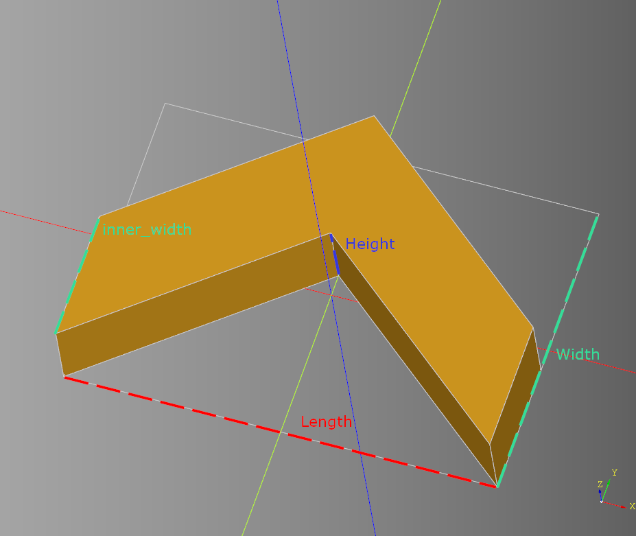
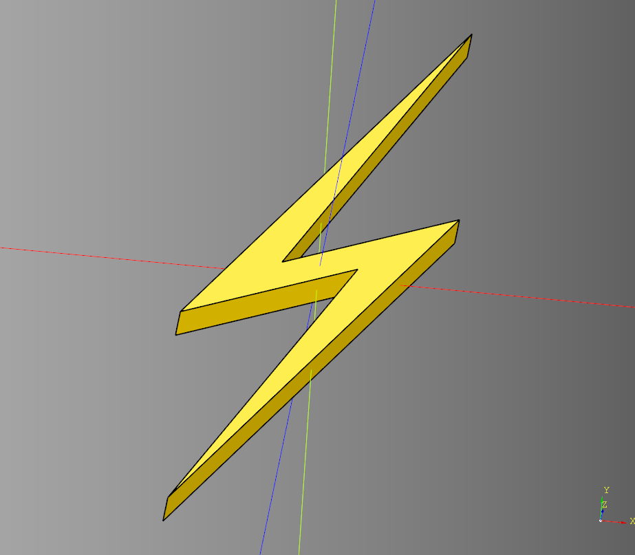

# Shape Documentation

## Example Usage

``` python
import cadquery as cq #main cadquery library
from cadqueryhelper import shape # The shape library this document is about

part = shape.arrow() # Generate a solid using it's default values
cq.exporters.export(part,'out/arrow.stl') # write the file to an stil file

if part.metadata:
    print(part.metadata) # print the parts bounding box
```

The code above:
* Imports the required libraries.
* Generates a solid using default setting.
* Exports the solid to a file.
* Prints the parts metadata to the console.

#### Generated Output
<br />

Metadata / bounding box (Deprecated)
<br /><br />

----

## Shape Conventions
* **Length** is along the **X** axis
* **Width** is along the **Y** axis
* **Height** is along the **Z** axis
* Shapes are centered along the X, Y, and Z axis.

---

# Shapes

---

## Arch Pointed
### Parameters
* length
* width
* height
* inner_height

``` python
result = shape.arch_pointed(
  length=30,
  width=5,
  height=50,
  inner_height=25
)
```

<br />

* [source](../src/cadqueryhelper/shape/arch.py)
* [example](../example/shape/arch_pointed.py)
* [stl](../out/arch_pointed.stl)

---


## Arch Round
### Parameters
* length
* width
* height

``` python
result = shape.arch_round(length=30, width=5, height=50)
```

<br />

* [source](../src/cadqueryhelper/shape/arch.py)
* [example](../example/shape/arch_round.py)
* [stl](../out/arch_round.stl)

---

## Arrow
### Parameters
* length
* inner_length
* width
* width_outset
* height

``` python
result = shape.arrow(
  length=10,
  inner_length=5,
  width=5,
  width_outset=2,
  height=3
)
```

<br />

* [source](../src/cadqueryhelper/shape/arrow.py)
* [example](../example/shape/arrow.py)
* [stl](../out/arrow.stl)


### Examples

#### Negative width_outset

``` python
result = shape.arrow(width_outset=-1)
```

<br />

---

## Chevron
### Parameters
* length
* width
* height
* inner_width
* alt

``` python
result = shape.chevron(
  length=10,
  width=7,
  height=2,
  inner_width=3,
  alt=False
)
```

<br />

* [source](../src/cadqueryhelper/shape/chevron.py)
* [example](../example/shape/chevron.py)
* [stl](../out/chevron.stl)


### Example
#### Chevron with alt set to True

``` python
alt = shape.chevron(
  length=10,
  width=7,
  height=2,
  inner_width=3,
  alt=True
)
```

<br />

* [stl](../out/chevron_alt.stl)

---
## Cone
### Parameters
* radius - base
* radius_top
* height

``` python
result = shape.cone(radius=1, radius_top=0, height=2)
```

<br />

* [source](../src/cadqueryhelper/shape/cone.py)
* [example](../example/shape/cone.py)
* [stl](../out/cone.stl)
---

## Cross
### Parameters
* length
* width
* height
* cross_length
* cross_width
* x_translate - Distance of length crossbeam from center.
* y_translate - Distance of width crossbeam from center.

``` python
result = shape.cross(
  length=10,
  width=10,
  height=2,
  cross_length=1,
  cross_width=1,
  x_translate=0,
  y_translate=0
)
```

<br />

* [source](../src/cadqueryhelper/shape/cross.py)
* [example](../example/shape/cross.py)
* [stl](../out/cross.stl)

### Examples

#### Move crossbeams from center

``` python
result = shape.cross(
  cross_length=2,
  cross_width=2,
  x_translate=-1,
  y_translate=2.5
)
```

<br />

---
## Corner Join
### parameters
* length
* width
* height
* side_width = 1 
* corner_chamfer = 0

``` python
chape = shape.corner_join(
    length = 10,
    width = 6,
    height = 5,
    side_width = 1,
    corner_chamfer = 1
)
```

<br />

* [source](../src/cadqueryhelper/shape/cornerJoin.py)
* [example](../example/shape/cornerJoin.py)
* [stl](../out/cornerJoin.stl)

---
## Cube
### Parameters
* length
* width
* height

``` python
result = shape.cube(length=5, width=5, height=5)
```

<br />

* [source](../src/cadqueryhelper/shape/cube.py)
* [example](../example/shape/cube.py)
* [stl](../out/cube.stl)

---
## Cylinder
### Parameters
* radius
* height

``` python
result = shape.cylinder(radius=2.5, height=5)
```

<br />

* [source](../src/cadqueryhelper/shape/cylinder.py)
* [example](../example/shape/cylinder.py)
* [stl](../out/cylinder.stl)

---
## Diamond
### Parmeters
* length
* width
* height

``` python
result = shape.diamond(length=10, width=5, height=3)
```

<br />

* [source](../src/cadqueryhelper/shape/diamond.py)
* [example](../example/shape/diamond.py)
* [stl](../out/diamond.stl)
---

## I-Beam
### Parameters
* length
* width
* height
* web_thickness
* flange_thickness
* join_distance

``` python
result = shape.i_beam(
  length=30,
  width=5,
  height=10,
  web_thickness=2,
  flange_thickness=2,
  join_distance=1.3
)
```


<br /><br />
<br />

* [source](../src/cadqueryhelper/shape/iBeam.py)
* [example](../example/shape/iBeam.py)
* [stl](../out/ibeam.stl)

### Wiki
* [Wikpedia](https://en.wikipedia.org/wiki/I-beam)
* [Wiki Image](https://en.wikipedia.org/wiki/File:I-BeamCrossSection.svg)

---

## Lightning
### Parameters
* length
* width
* height
* x_dist
* y_dist

``` python
result = shape.lightning(
    length = 25,
    width = 50,
    height = 5,
    x_dist = 3,
    y_dist = 6
)
```

<br />

* [source](../src/cadqueryhelper/shape/lightning.py)
* [example](../example/shape/lightning.py)
* [stl](../out/lightning.stl)

---

## Pinwheel
### Parameters
* count
* height
* ring_params - list of ring param dictionaries
  * radius
  * start_angle

``` python
ring_params = []
ring_params.append({"radius": 150, "start_angle":0})
ring_params.append({"radius":100,"start_angle":30})
ring_params.append({"radius":30,"start_angle":80})
result = shape.pinwheel(count = 10, height = 3, ring_params = ring_params)
```

<br />
<br />

* [source](../src/cadqueryhelper/shape/pinwheel.py)
* [example](../example/shape/pinwheel.py)
* [stl](../out/pinwheel.stl)


---
## Rail
### Parameters
* length
* width
* height
* inner_height

``` python
result = shape.rail(length=6, width=1, height=5, inner_height=1.5)
```


<br />

* [source](../src/cadqueryhelper/shape/rail.py)
* [example](../example/shape/rail.py)
* [stl](../out/rail.stl)

---
## Regular Polygon
[wikipedia](https://en.wikipedia.org/wiki/Regular_polygon)
### Parameters
* radius
* sides
* height

``` python
result = shape.regular_polygon(radius=10, sides=6, height=5)
```

<br />

* [source](../src/cadqueryhelper/shape/regularPolygon.py)
* [example](../example/shape/hexagon.py)
* [stl](../out/hexagon.stl)


---
## Rhombus
### Parameters
* width
* offset
* height

``` python
result = shape.rhombus(width=10, offset=4, height=5)
```

<br />

* [source](../src/cadqueryhelper/shape/rhombus.py)
* [example](../example/shape/rhombus.py)
* [stl](../out/rhombus.stl)

---
## Sphere
### Parameters
* radius

``` python
result = shape.sphere(radius=5)
```

<br />

* [source](../src/cadqueryhelper/shape/sphere.py)
* [example](../example/shape/sphere.py)
* [stl](../out/sphere.stl)

---
## Star
### Parameters
* outer_radius
* inner_radius
* points
* height

``` python
result = shape.star(
  outer_radius=10,
  inner_radius=5,
  points=5,
  height=3
)
```

<br />

* [source](../src/cadqueryhelper/shape/star.py)
* [example](../example/shape/star.py)
* [stl](../out/star.stl)
