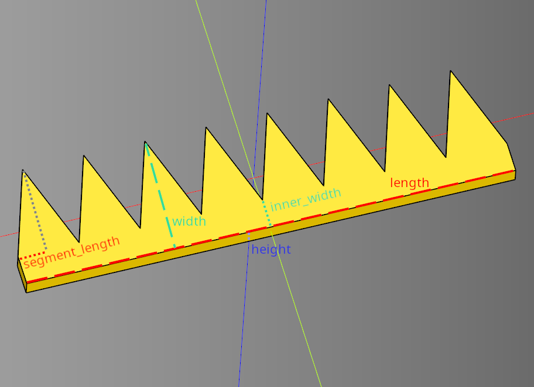

# Wave Documentation

---

## Conventions
* **Length** is along the **X** axis
* **Width** is along the **Y** axis
* **Height** is along the **Z** axis
* Waves are centered along the X, Y, and Z axis.

---

## Triangle

### Parameters
* length
* width
* height
* segment_length
* inner_width

``` python
result = pattern.triangle(length=80, width=20, height=3, segment_length=5, inner_width=5)
```

<br />

* [source](../src/cadqueryhelper/wave/triangle.py)
* [example](../example/wave/triangle.py)
* [stl](../out/wave_triangle.stl)
