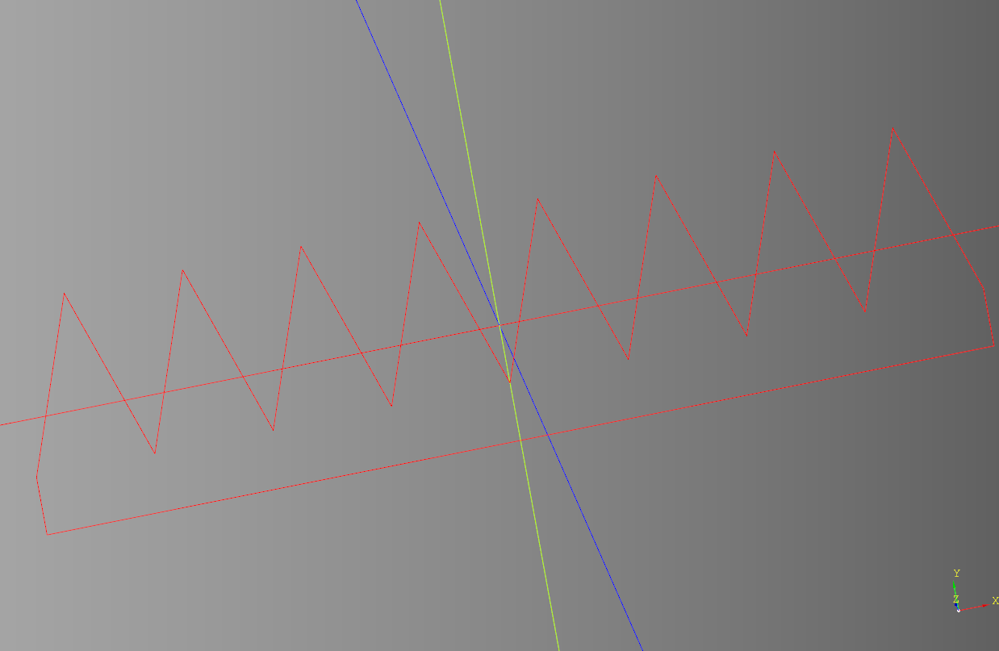
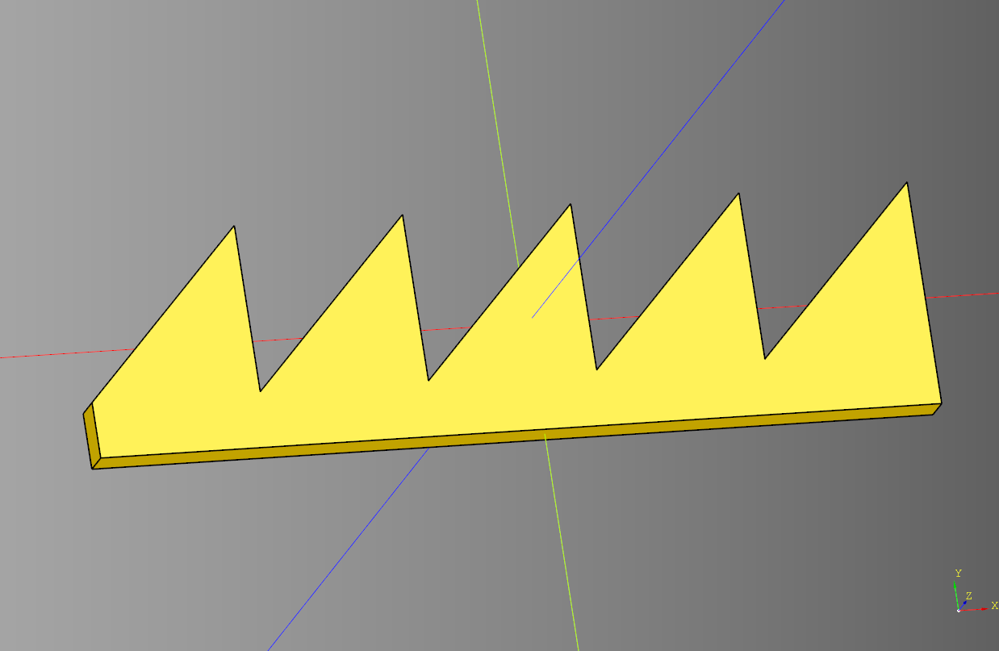
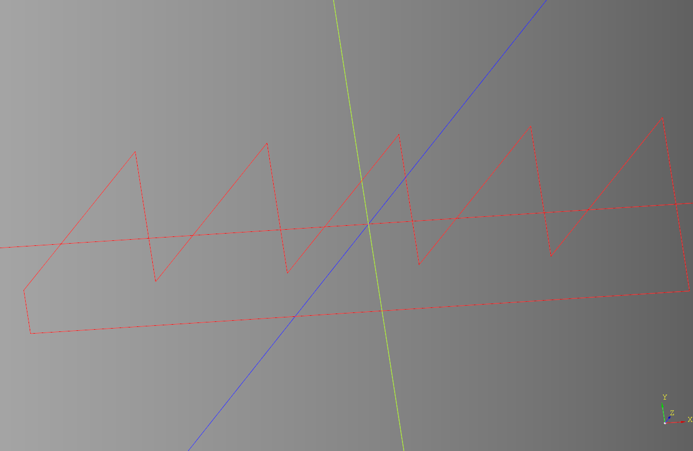
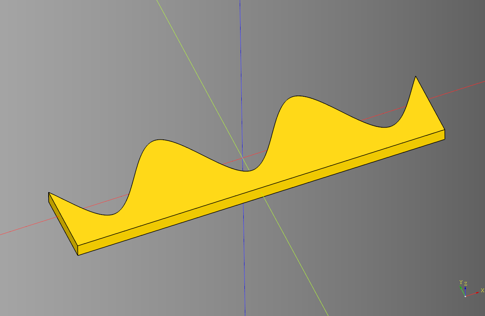
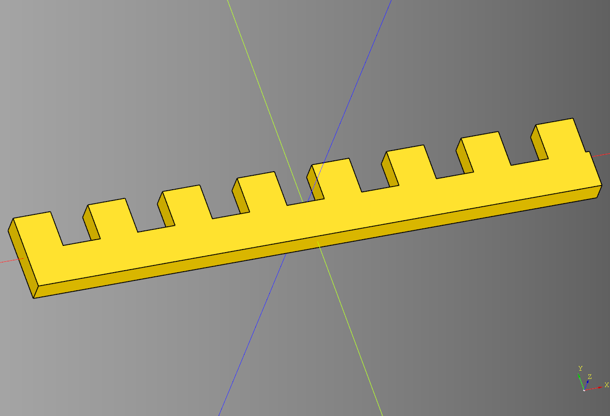
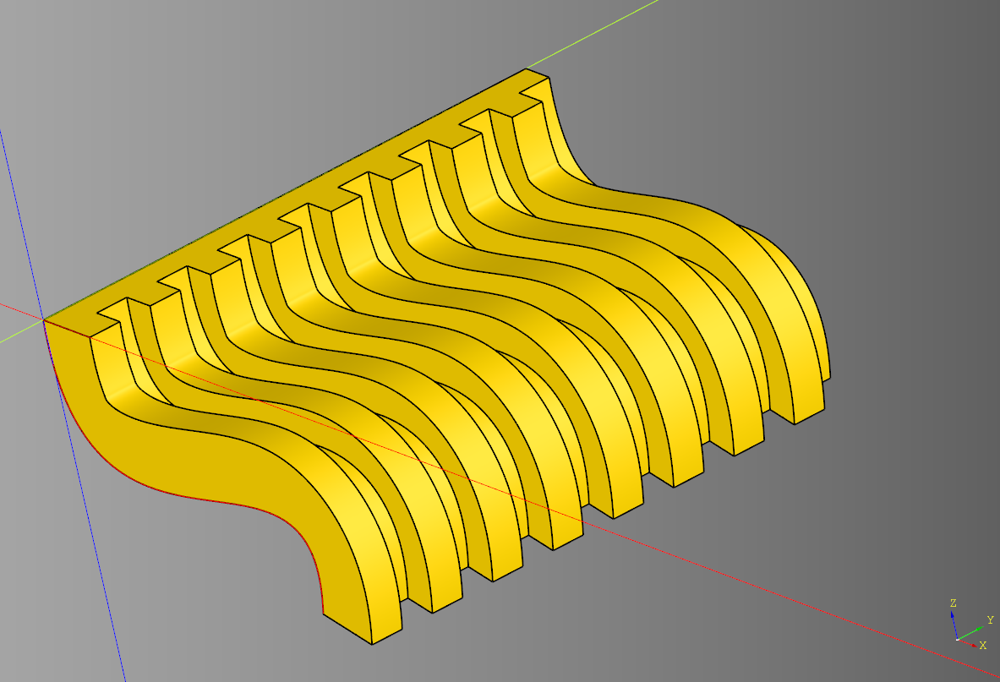
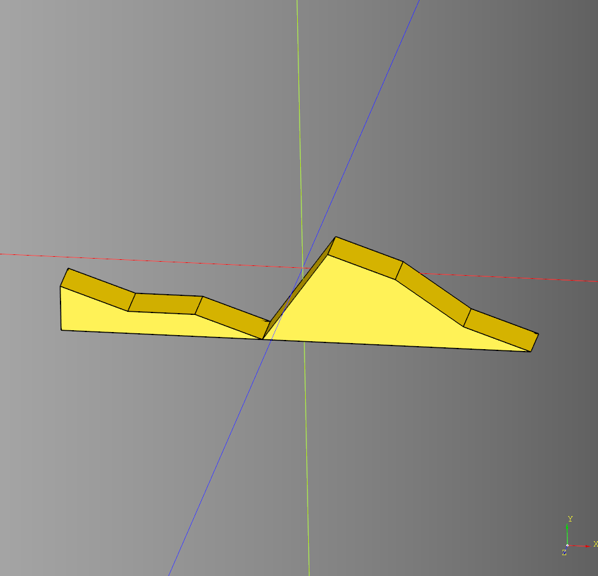
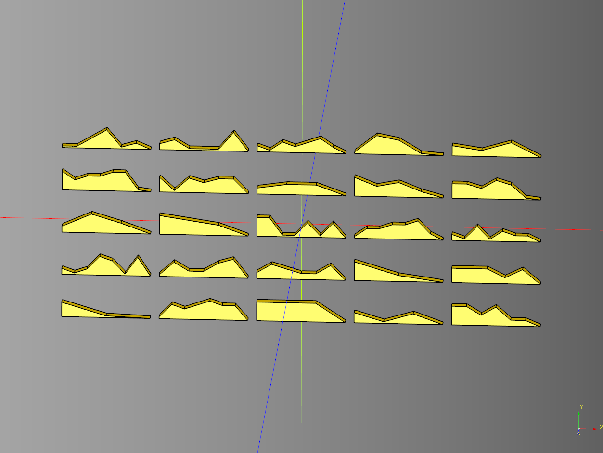

# Wave Documentation

## Example Usage
``` python
import cadquery as cq
from cadqueryhelper import wave

result = wave.triangle(
    length=80,
    width=20,
    height=3,
    segment_length=5,
    inner_width=5
)
cq.exporters.export(result,'stl/wave_triangle.stl')
```

The code above:
* Imports the required libraries.
* Generates a solid wave.
* Exports the solid to a file.

---

## Conventions
* **Length** is along the **X** axis
* **Width** is along the **Y** axis
* **Height** is along the **Z** axis
* Waves are centered along the X, Y, and Z axis.

---

## Triangle

### parameters
* length : float
* width : float
* height : float
* segment_length : float
* inner_width : float

``` python
result = pattern.triangle(
  length=80,
  width=20,
  height=3,
  segment_length=5,
  inner_width=5
)
```

<br />

* [source](../src/cadqueryhelper/wave/triangle.py)
* [example](../example/wave/triangle.py)
* [stl](../stl/wave_triangle.stl)

### Zero height

``` python
result = wave.triangle(
  length=80,
  width=20,
  height=0,
  segment_length=5,
  inner_width=5
)
```
Returns the line segment for further operations.
<br />

---
## Sawtooth

### parameters
* length : float
* width : float
* height : float
* segment_length : float
* inner_width : float

``` python
result = wave.sawtooth(
    length=80,
    width=20,
    height=3,
    segment_length=15,
    inner_width=5
)
```

<br />

* [source](../src/cadqueryhelper/wave/sawtooth.py)
* [example](../example/wave/sawtooth.py)
* [stl](../stl/wave_sawtooth.stl)

### Zero height

``` python
result = wave.triangle(
  length=80,
  width=20,
  height=0,
  segment_length=5,
  inner_width=5
)
```
Returns the line segment for further operations.
<br />

---

## Sine

### parameters
* length : float
* width : float
* height : float
* segment_length : float
* inner_width : float

``` python
result = wave.sine(
    length=80,
    width=20,
    height=3,
    segment_length=15,
    inner_width=5
)
```



---

## Square

### parameters
* length : float
* width : float
* height : float
* segment_length : float
* inner_width : float

``` python
result = wave.square(
    length=75.5,
    width=10,
    height=3,
    segment_length=5,
    inner_width=5
)
```

<br />

* [source](../src/cadqueryhelper/wave/square.py)
* [example](../example/wave/square.py)
* [stl](../stl/wave_square.stl)

### Zero height & sweep

``` python
pipe_path = cq.Workplane("XZ").spline([(0,0), (20,-20), (50,-20), (50,-30)])
result = result = wave.square(
    length=75.5,
    width=10,
    height=0,
    segment_length=5,
    inner_width=5
).sweep(pipe_path, multisection=0, isFrenet=False, clean=False)
```

<br />

---

## Uneven

Creates an uneven collection or points

### parameters
* length : float 
* width : float = 2.5 - Maximum width of points.
* min_width : float = 0.0001 - Minimum width of points.
* step : float = .5 - Step distance between min_width and width.
* count : tuple[int,int]|int = (2,8) - can be a tuple for min/max points; or an int for a fixed number of points.
* axis : str = "XY" - cadquery workplane axis.
* seed : str|None = None - Sets the random seed, None leaves random.seed unchanged.
* offset : float = 0 - Offset of the workplane.

### returns
* cq.Wire - will need to be extruded to generate a shape.

``` python
import cadquery as cq
from cadqueryhelper.wave import uneven

result = uneven(
    length = 10, 
    width = 2.5,
    min_width = 0.0001,
    step = .5,
    count = (2,8), 
    axis = "XY",
    seed = "test",
    offset = 0
)

show_object(result.extrude(1))
```
<br />

* [source](../src/cadqueryhelper/wave/uneven.py)
* [example](../example/wave/uneven.py)
* [stl](../stl/wave_uneven.stl)

### Uneven Grid Example
Highlights randomized different variations.

``` python
import cadquery as cq
from cadqueryhelper.wave import uneven
import random

random.seed('test_3')
def add_uneven(loc:cq.Location)->cq.Shape:
    ex = uneven(
        length = 10, 
        width = 2.5,
        min_width = 0.2,
        step = .5,
        count= (2,8), 
        axis = "XY",
        seed= None,
        offset= 0
    )
    return ex.val().located(loc) #type:ignore

uneven_grid_example = (
    cq.Workplane("XY")
    .rarray(
        xSpacing = 11, 
        ySpacing = 5,
        xCount = 5, 
        yCount= 5, 
        center = True)
    .eachpoint(callback = add_uneven)
).extrude(1)

show_object(uneven_grid_example)
```

<br />

* [example](../example/wave/uneven_grid.py)
* [stl](../stl/wave_uneven_gid.stl)

